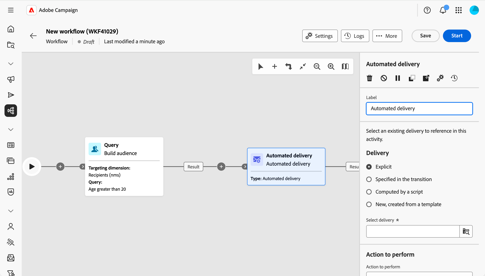
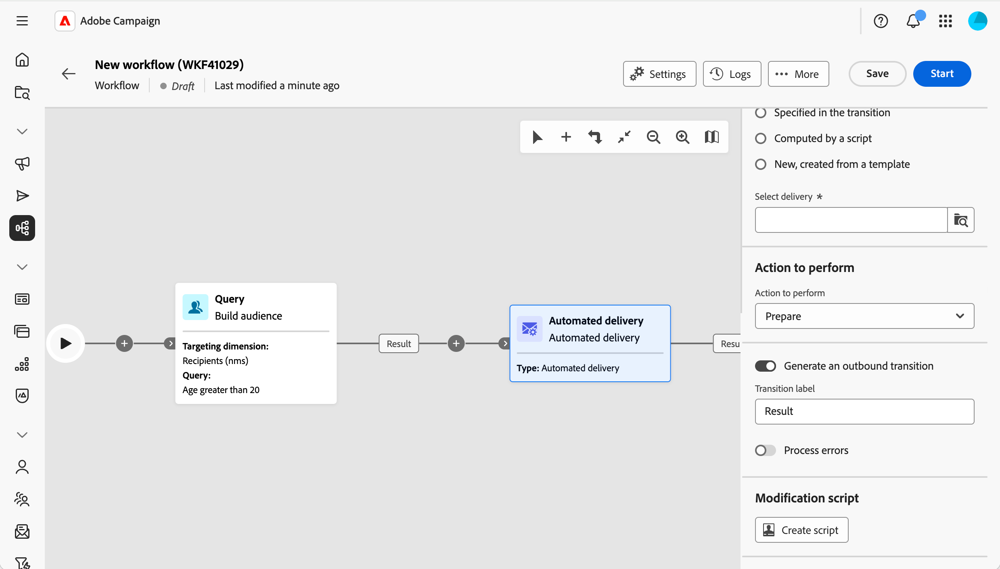

# 自動化傳遞 {#automated-delivery}

>[!CONTEXTUALHELP]
>id="acw_homepage_welcome_rn4"
>title="自動化傳遞活動"
>abstract="工作流程浮動視窗現在提供自動傳送工作流程活動。 您可以用它直接在您的工作流程中建立或執行傳遞動作（準備、傳送證明、準備和開始等）。"
>additional-url="https://experienceleague.adobe.com/docs/campaign-web/v8/release-notes/release-notes.html?lang=zh-hant" text="請參閱發行說明"

>[!CONTEXTUALHELP]
>id="acw_orchestration_automated-delivery"
>title="自動化傳遞活動"
>abstract="**自動傳遞**&#x200B;活動用於自動化：在您的工作流程中建立或重新使用傳遞，然後選擇要執行的動作（準備、準備和開始、傳送證明等）。 您可以選取在工作流程外部建立的現有明確傳送，或在每次活動執行時從範本建立新的傳送。"

**自動傳遞**&#x200B;活動可讓您直接在您的工作流程中建立、設定及執行傳遞動作。 當您想要依排程執行預先定義的交貨，或作為自動化流程的一部份，或當您想要在每次活動執行時從樣版產生新交貨時，使用此選項。

<!--
**[Continuous delivery](continuous-delivery.md)** always uses a template. The first run creates one delivery; later runs send to new recipients through that same delivery. **Automated delivery** is different: you either reuse one existing delivery every run, or you create a new delivery from a template each time—so each run can be its own delivery if you want. -->

若要設定此活動，請遵循下列步驟：

1. 定義傳遞設定，[瞭解詳情](#delivery-settings)
1. 選取要執行的動作，[瞭解詳情](#action-to-execute)
1. 設定轉換，[瞭解詳情](#transition-to-execute)
1. 定義修改指令碼，[瞭解詳情](#script)

## 定義傳送設定 {#delivery-settings}

設定活動時，您需選擇傳送來源。 本節提供兩個選項：

{zoomable="yes"}

* 當您要針對現有傳遞（例如獨立傳遞或從行銷活動建立的傳遞）採取行動時，請選取&#x200B;**明確傳遞**。 使用&#x200B;**選取傳遞**&#x200B;按鈕選取傳遞。 每次工作流程執行並到達此活動時，都會對&#x200B;**相同**&#x200B;傳遞採取行動。 每次執行不會建立新的傳遞。 活動會重複使用相同的傳送。 當您想要重複準備或傳送單一傳遞時（例如依排程或在核准步驟後），此功能會很有用。

<!-- by default, the list shows unfinished deliveries in the Deliveries folder. You can browse other folders to select a delivery from another campaign. You choose the action to perform (prepare, prepare and start, send a proof, and so on).-->

* 當您想要在每次活動執行時建立&#x200B;**新的**&#x200B;傳遞時，請選取&#x200B;**新增（從範本**&#x200B;建立）。 使用&#x200B;**選取範本**&#x200B;按鈕選取傳遞範本。 每次執行都會根據該範本產生新的傳遞。 當每個工作流程執行都應產生其自己的不同傳送時（例如每次執行一個電子郵件），請使用此選項。

<!-- Unlike the Continuous delivery activity, there is no “append” to a previous execution—each run produces a separate delivery. -->

>[!NOTE]
>
>轉換&#x200B;**中指定的**&#x200B;和&#x200B;**由指令碼計算**&#x200B;選項（用於進階使用案例）只能在使用者端主控台中設定。 請參閱[Campaign v8檔案](https://experienceleague.adobe.com/zh-hant/docs/campaign/automation/workflows/wf-activities/action-activities/delivery){target="_blank"}。

## 選取要執行的動作 {#action-to-execute}

在此區段中，選擇活動對傳送的作用。 可以使用以下選項：

{zoomable="yes"}

* **儲存**：建立並儲存傳遞，而不分析或傳送。
* **預估目標**：計算傳遞目標以評估其潛在（第一個分析階段）。
* **準備**：執行完整分析（目標計算與內容準備）。 不會傳送傳遞。
* **傳送證明**：傳送傳遞的證明。
* **準備並開始**：執行完整分析（目標計算與內容準備）並傳送傳遞。

## 設定轉變 {#transition-to-execute}

此區段可讓您選擇是否要在活動後產生轉變。 可以使用以下選項：

{zoomable="yes"}

* **產生出站轉變**：活動完成時產生出站轉變。
* **轉變標籤**：可讓您自訂畫布轉變上顯示的標籤。
* **處理錯誤**：新增處理錯誤的額外轉換。

## 定義修改指令碼 {#script}

您可以使用指令碼來變更活動的行為，例如傳送引數，例如活動標籤。 當您需要此活動的自訂邏輯時，請使用此選項。

按一下&#x200B;**建立指令碼**，然後在編輯器中寫入您的修改邏輯。

## 相關主題 {#related}

* [關於工作流程活動](about-activities.md)
* [持續傳遞](continuous-delivery.md)
* [電子郵件、簡訊、推播、直接郵件活動](channels.md)
* [傳遞範本](../../msg/delivery-template.md)
