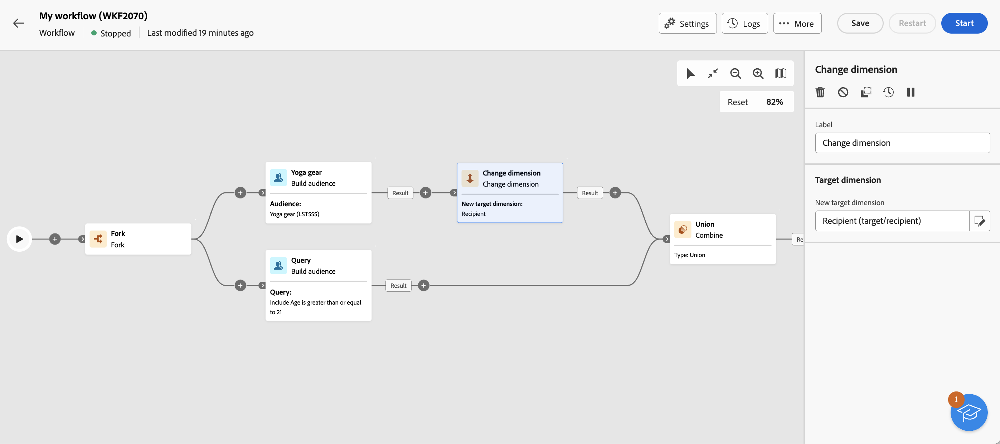

# 建置對象 {#build-audience}

>[!CONTEXTUALHELP]
>id="acw_orchestration_build_audience"
>title="建立對象活動"
>abstract="此 **建立對象** 活動可讓您定義將進入工作流程的對象。 在工作流程內容中傳送訊息時，訊息對象未定義於頻道活動中，但定義於 **建立對象** 活動。"

「**建置對象**」活動是一種「**目標定位**」活動。此活動可讓您定義會進入工作流程的對象。在工作流程內容中傳送訊息時，訊息對象未定義於頻道活動中，但定義於 **建立對象** 活動。

若要定義對象族群，您可以：

* 選取現有對象，在用戶端主控台中建立成清單。
* 選取 Adobe Experience Platform 對象。
* 定義篩選條件並將其合併，以使用規則產生器建置新的對象。

>[!NOTE]
>
>在此情況下，您無法從檔案載入對象。為此，您需要建立獨立的電子郵件傳送。 [了解更多](../../audience/about-recipients.md)

<!--
The **Build audience** activity can be placed at the beginning of the workflow or after any other activity. Any activity can be placed after the **Build audience**.
-->

## 設定建置對象活動

>[!CONTEXTUALHELP]
>id="acw_orchestration_build_audience_dimension"
>title="選取目標維度"
>abstract="目標定位維度可讓您定義作業的目標母體：收件者、合約受益人、操作者、訂閱者等。預設情況下，會從收件者中選取目標。"

請按照以下步驟設定「**建置對象**」活動：

1. 新增「**建置對象**」活動。
1. 定義標籤。
1. 定義對象類型：「**建立您自己的**」或是「**讀取對象**」。

若要建立您自己的查詢，請依照以下額外步驟進行：

1. 選取「**建立您自己的 (查詢)**」。
1. 選擇「**目標定位維度**」。目標定位維度可讓您定義作業的目標母體：收件者、合約受益人、操作者、訂閱者等。預設情況下，會從收件者中選取目標。請參閱 [v8 文件](https://experienceleague.adobe.com/docs/campaign/automation/workflows/introduction/wf-type/targeting-workflows.html#targeting-and-filtering-dimensions){target="_blank"}。
1. 按一下&#x200B;**「繼續」**。
1. 使用規則產生器定義您的查詢，以您設計新電子郵件時建立對象的相同方式。請參閱本[章節](../../audience/segment-builder.md)。

若要選取現有對象，請依照以下步驟進行：

1. 選取「**讀取對象**」。
1. 按一下&#x200B;**「繼續」**。
1. 選取您的對象，以您設計新電子郵件時使用對象的相同方式。請參閱本[章節](../../audience/add-audience.md)。

>[!IMPORTANT]
>
>如果您想使用 **[!UICONTROL 建立對象]** 以Experience Platform對象為目標的活動，您需要新增 **[!UICONTROL 變更維度]** 活動後，確保受眾的目標維度設為「收件者」。 此頁面底部提供工作流程範例。

## 範例

以下範例是一個包含兩個「**建置對象**」活動的工作流程。第一個目標是撲克牌遊戲玩家對象，然後是電子郵件傳遞。第二個目標是 VIP 用戶端對象，然後是簡訊傳遞。

這是另一個工作流程範例，其中結合了Adobe Experience Platform對象與Adobe Campaign對象。 若要允許結合這些對象，請 **[!UICONTROL 變更維度]** 具有「收件者」目標維度的活動會新增至Adobe Experience Platform對象之後。 [瞭解如何設定變更維度活動](change-dimension.md)

