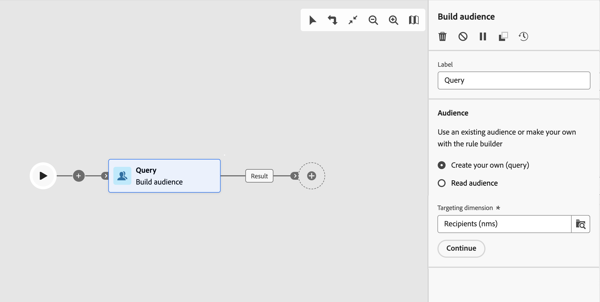

# 建置客群 {#build-audience}

>[!CONTEXTUALHELP]
>id="acw_orchestration_build_audience"
>title="建置對象活動"
>abstract="「**建置對象**」活動可讓您定義會進入工作流程的對象。在工作流程中傳送訊息時，訊息對象不會在管道活動中定義，而是在「**建置對象**」活動中定義。"

「**建置客群**」活動是一種「**目標定位**」活動。此活動可讓您定義會進入工作流程的客群。在工作流程中傳送訊息時，訊息對象不會在管道活動中定義，而是在「**建置對象**」活動中定義。

若要定義客群群體，您可以：

* 選取現有客群，在用戶端主控台中建立成清單。
* 選取 Adobe Experience Platform 客群。
* 定義並結合篩選條件，以使用查詢模型工具建立新對象。

>[!NOTE]
>
>使用「建立對象」活動無法鎖定從檔案載入的對象。 若要這麼做，您必須先使用&#x200B;**載入檔案**&#x200B;活動，然後再使用&#x200B;**調解**&#x200B;活動。 [了解更多](../../audience/about-recipients.md)

<!--
The **Build audience** activity can be placed at the beginning of the workflow or after any other activity. Any activity can be placed after the **Build audience**.
-->

## 設定建置對象活動 {#build-audience-configuration}

>[!CONTEXTUALHELP]
>id="acw_orchestration_build_audience_audienceselector"
>title="客群"
>abstract="選取您的對象，與您設計新傳遞時使用對象的方式相同。"

請按照以下步驟設定「**建置客群**」活動：

1. 新增「**建置客群**」活動。
1. 定義標籤。
1. 定義客群類型：「**建立您自己的**」或是「**讀取客群**」。
1. 請依照下列標籤中詳述的步驟設定您的對象。

>[!BEGINTABS]

>[!TAB 建立您自己的（查詢）]

若要建立自己的查詢，請依照下列步驟進行：

1. 選取「**建立您自己的 (查詢)**」。
1. 選擇「**目標定位維度**」。目標維度可讓您定義作業的目標母體，例如收件者、合約受益者、操作者或訂閱者。 預設情況下，會從收件者中選取目標。[進一步瞭解目標維度](../../audience/about-recipients.md#targeting-dimensions)
1. 按一下&#x200B;**「繼續」**。
1. 使用查詢建模器來定義您的查詢，就像在設計新電子郵件時建立對象一樣。 [瞭解如何使用查詢模型工具](../../query/query-modeler-overview.md)

>[!TAB 讀取客群]

若要選取現有客群，請依照以下步驟進行：

1. 選取「**讀取客群**」。
1. 按一下&#x200B;**「繼續」**。
1. 選取您的對象，就像在設計新傳送時使用對象一樣。 請參閱本[章節](../../audience/add-audience.md)。

>[!ENDTABS]

## 範例 {#build-audience-examples}

以下範例是一個包含兩個「**建置客群**」活動的工作流程。第一個目標是撲克玩家客群，然後是電子郵件傳遞。第二個目標是 VIP 用戶端客群，然後是簡訊傳遞。

