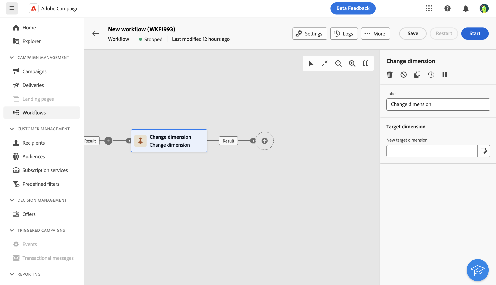

# 變更維度 {#change-dimension}

<!--
>[!CONTEXTUALHELP]
>id="acw_orchestration_dimension_complement"
>title="Change dimension activity"
>abstract="The Change dimension activity allows you to..."
-->

此 **變更維度** 活動是 **目標定位** 活動。 此活動可讓您在建立對象時變更目標維度。 此活動會根據資料範本和輸入維度移動軸。 例如，您可以從「合約」維度切換至「客戶」維度。

您也可以使用此活動來定義新目標的其他欄，並定義重複資料刪除的條件。

## 設定

請依照下列步驟設定 **變更維度** 活動：

1. 新增 **變更維度** 活動至您的工作流程。

   

1. 透過「變更維度」欄位選取新的目標維度。

沒有其他資訊??