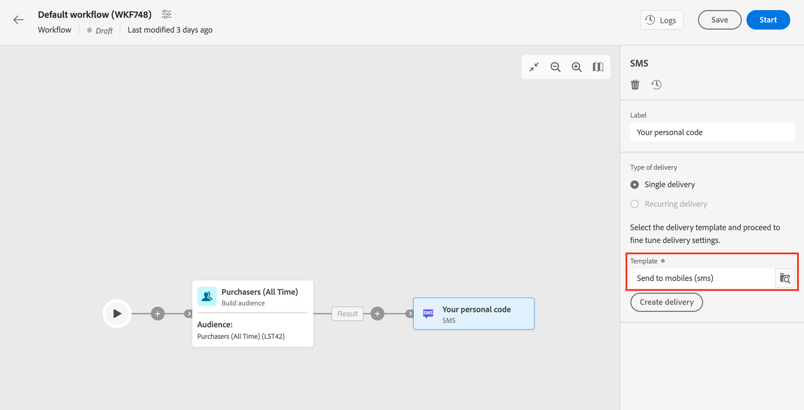

# 電子郵件、簡訊、推播 {#channel}

Adobe Campaign Web可讓您跨電子郵件、簡訊和推播頻道自動執行行銷活動。 您可以將管道活動結合到工作流程畫布中，以建立跨管道工作流程，進而根據客戶行為和資料觸發動作。

例如，您可以建立一個歡迎電子郵件活動，其中包括跨不同管道的一系列訊息，例如電子郵件、簡訊和推播。您也可以在客戶完成購買後，傳送後續追蹤電子郵件，或透過簡訊向客戶傳送個人化生日訊息。

透過使用管道活動，您可以建立全面且個人化的行銷活動，吸引多個接觸點的客戶並促進轉換。

以下是新增 **頻道** 工作流程中的活動：

1. 確定您已新增 **建立對象** 活動。 對象是傳遞的主要目標：接收訊息的收件者。 在行銷活動工作流程的內容中傳送訊息時，訊息對象不會定義在管道活動中，而是定義在 **建立對象** 活動。 請參閱[本節](build-audience.md)。

   

1. 選取傳遞活動：**[!UICONTROL 電子郵件]**、**[!UICONTROL 簡訊]**、**[!UICONTROL 推播通知 (Android)]** 或&#x200B;**[!UICONTROL 推播通知 (iOS)]**。

1. 選取傳遞 **範本**. 範本是通道專用的預先設定傳送設定。 每個管道都有內建範本可供使用，並依預設預先填入。 [了解更多](../../msg/delivery-template.md)

   

   您可以從管道活動設定左窗格中選取其他範本。 如果先前選取的對象與頻道不相容，則您無法選取範本。 若要解決此問題，請更新 **建立對象** 活動，以選取具有正確目標對應的對象。 進一步瞭解中的目標對應 [Adobe Campaign v8 （主控台）檔案](https://experienceleague.adobe.com/docs/campaign/campaign-v8/audience/add-profiles/target-mappings.html){target="_blank"}.

1. 按一下 **建立傳遞**. 以建立獨立傳送的方式定義訊息設定和內容。 您也可以排程和模擬內容。 [了解更多](../../msg/gs-messages.md)。

1. 導覽回工作流程並儲存變更。

1. 按一下 **開始** 以啟動工作流程。

   依預設，啟動工作流程會觸發訊息準備階段，而不會立即傳送訊息。

1. 開啟您的傳送活動，確認傳送來自 **檢閱並傳送** 按鈕。

1. 從您的傳送控制面板，按一下 **傳送**.

## 範例

以下是跨管道工作流程範例，其中包含細分和兩個傳送。 工作流程的目標是住在巴黎並對咖啡機感興趣的所有客戶。 在此群體中，會傳送電子郵件給一般客戶，並傳送簡訊給VIP使用者端。

<!--
description, which use case you can perform (common other activities that you can link before of after the activity)

how to add and configure the activity

example of a configured activity within a workflow
The Email delivery activity allows you to configure the sending an email in a workflow. 

-->

<!-- Scheduled emails available?

This can be a single send email and sent just once, or it can be a recurring email.
* Single send emails are standard emails, sent once.
* Recurring emails allow you to send the same email multiple times to different targets over a defined period. You can aggregate the deliveries per period in order to get reports that correspond to your needs.

When linked to a scheduler, you can define recurring emails.
Email recipients are defined upstream of the activity in the same workflow, via an Audience targeting activity.

-->

<!--The message preparation is triggered according to the workflow execution parameters. From the message dashboard, you can select whether to request or not a manual confirmation to send the message (required by default). You can start the workflow manually or place a scheduler activity in the workflow to automate execution.-->
