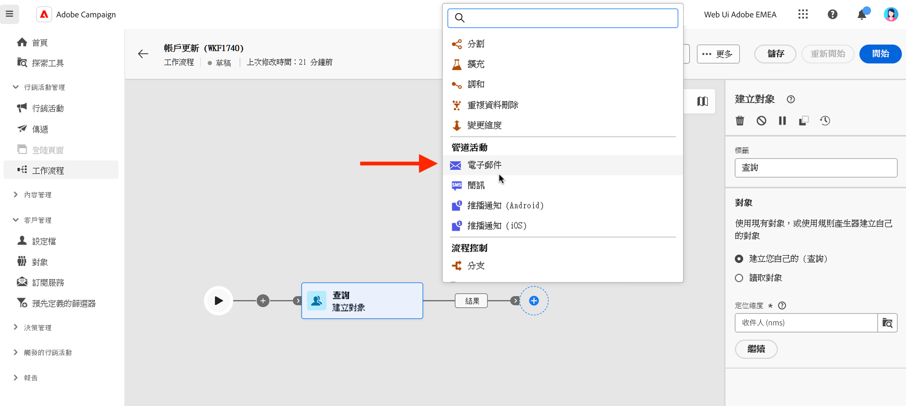

# 電子郵件、簡訊、推播、直接郵件活動 {#channel}

Adobe Campaign Web可讓您跨電子郵件、簡訊、直接郵件和推播頻道，自動執行行銷活動。 您可以將管道活動組合到工作流程畫布中，建立可根據客戶行為和資料觸發動作的跨管道工作流程。

例如，您可以建立歡迎電子郵件行銷活動，其中包括跨不同頻道的一系列訊息，例如電子郵件、簡訊、推播和直接郵件。 您還可以在客戶完成購買後傳送後續追蹤電子郵件，或透過簡訊向客戶傳送個人化的生日祝賀訊息。

使用管道活動，您即可建立全面性和個人化的行銷活動，從多個接觸點和客戶互動並提升轉換率。

>[!NOTE]
>
>您也可以在行銷活動工作流程的內容之外建立單次傳送。 請在以下章節瞭解更多資訊：
>* [建立獨立的電子郵件傳遞](../../email/create-email.md)
>* [建立獨立SMS傳遞](../../sms/create-sms.md)
>* [建立獨立推播傳遞](../../push/create-push.md)
>* [建立獨立的直接郵件傳遞](../../direct-mail/create-direct-mail.md)

## 先決條件 {#channel-activity-prereq}

開始使用相關活動建置您的工作流程：

* 插入管道活動之前，您必須定義對象。 對象是您傳送的主要目標：接收訊息的設定檔。 在行銷活動工作流程內容中傳送訊息時，訊息對象不會定義在頻道活動中，而是會定義在專用活動中，例如：

   * **建立對象**&#x200B;活動。 [了解更多](build-audience.md)。

     

   * **載入檔案**&#x200B;活動，接著是&#x200B;**調解**&#x200B;活動。 [了解更多](load-file.md)。

     

* 若要傳送循環傳遞，請使用&#x200B;**排程器**&#x200B;活動啟動您的工作流程。 您也可以針對單次傳送使用&#x200B;**排程器**&#x200B;活動，以設定該傳送的聯絡日期。 您也可以在傳送設定中設定聯絡日期。 請參閱[本節](scheduler.md)。

## 設定管道活動 {#create-a-delivery-in-a-workflow}

>[!CONTEXTUALHELP]
>id="acw_orchestration_email"
>title="電子郵件活動"
>abstract="電子郵件活動有助於在您的工作流程中傳送電子郵件，允許傳送一次性和定期的訊息。此活動可用來自動化傳送電子郵件至相同工作流程所計算目標的流程。您可以將管道活動組合到工作流程畫布中，建立可根據客戶行為和資料觸發動作的跨管道工作流程。"

>[!CONTEXTUALHELP]
>id="acw_orchestration_sms"
>title="SMS 活動"
>abstract="SMS 活動有助於在您的工作流程中傳送 SMS，允許傳送一次性和定期的訊息。此活動可用來自動化傳送 SMS 至相同工作流程所計算目標的流程。您可以將管道活動組合到工作流程畫布中，建立可根據客戶行為和資料觸發動作的跨管道工作流程。"

>[!CONTEXTUALHELP]
>id="acw_orchestration_push_ios"
>title="推播 iOS 活動"
>abstract="Push iOS 活動簡化了您工作流程中傳送 iOS 推播通知的流程。此活動可以傳送一次性和定期的訊息，自動將 iOS 推播通知傳送到相同工作流程中的預先定義目標。您可以將管道活動組合到工作流程畫布中，建立可根據客戶行為和資料觸發動作的跨管道工作流程。"

>[!CONTEXTUALHELP]
>id="acw_orchestration_push_android"
>title="推播 Android 活動"
>abstract="Push Android 活動簡化了您工作流程中傳送 Android 推播通知的流程。此活動可以傳送一次性和定期的訊息，自動將 Android 推播通知傳送到相同工作流程中的預先定義目標。您可以將管道活動組合到工作流程畫布中，建立可根據客戶行為和資料觸發動作的跨管道工作流程。"

>[!CONTEXTUALHELP]
>id="acw_orchestration_directmail"
>title="直接郵件活動"
>abstract="直接郵件活動有助於在您的工作流程中傳送直接郵件，允許傳送一次性和定期的訊息。此類活動可用來為生產直接郵件提供者所需的摘取檔案流程進行自動化。您可以將管道活動組合到工作流程畫布中，建立可根據客戶行為和資料觸發動作的跨管道工作流程。"

若要在工作流程內容中設定傳送，請遵循下列步驟：

1. 新增頻道活動： **[!UICONTROL 電子郵件]**、**[!UICONTROL 簡訊]**、**[!UICONTROL 推播通知(Android)]**、**[!UICONTROL 推播通知(iOS)]**&#x200B;或&#x200B;**[!UICONTROL 直接郵件]**。

1. 選取&#x200B;**傳遞型別**：單一或循環。

   * **單一傳遞**&#x200B;為單次傳遞，僅傳送一次，例如「黑色星期五」電子郵件。
   * 根據在[排程器活動](scheduler.md)中定義的執行頻率，**週期性傳遞**&#x200B;會多次傳送。 每次執行工作流程時，都會重新計算對象，並將傳送內容連同更新後的內容傳送給更新的對象。 例如，這可以是每週電子報或循環生日電子郵件。

1. 選取傳遞&#x200B;**範本**。範本是預先設定的傳遞設定 (特定於管道)。每個管道都會有一個內建範本，並且在預設情況下會預先填寫。[了解更多](../../msg/delivery-template.md)

   

   您可以從管道活動設定左窗格中選取範本。 如果之前選取的客群和管道不相容，則無法選取範本。若要解決此問題，請更新「**建置客群**」活動，以選取具有正確目標對應的客群。在[本節](../../audience/targeting-dimensions.md)中進一步瞭解目標對應

1. 按一下「**建立傳遞**」。然後，您可以像建立獨立傳送一樣定義訊息設定和內容。 您也可以測試和模擬內容。 [了解更多](../../msg/gs-messages.md)

1. 導覽回您的工作流程。 如果要繼續工作流程，請切換&#x200B;**產生出站轉變**&#x200B;選項，以在頻道活動後新增轉變。

1. 按一下「**開始**」以啟動您的工作流程。

   預設情況下，開始工作流程會觸發訊息準備階段，但不會立即傳送訊息。

1. 開啟您的頻道活動，以確認從&#x200B;**檢閱並傳送**&#x200B;按鈕進行傳送。

1. 在您的傳遞儀表板中，按一下「**傳送**」。

## 範例 {#cross-channel-workflow-sample}

以下是一個具有分段和兩個傳遞的跨管道工作流程範例。此工作流程會以所有居住在巴黎且對咖啡機感興趣的客戶為目標。針對此群體，會傳送電子郵件給普通客戶，並傳送簡訊給 VIP 用戶端。

<!--
description, which use case you can perform (common other activities that you can link before of after the activity)

how to add and configure the activity

example of a configured activity within a workflow
The Email delivery activity allows you to configure the sending an email in a workflow. 

-->

您也可以建立循環工作流程，在下午8點將個人化SMS傳送給住在巴黎的所有客戶。

<!-- Scheduled emails available?

This can be a single send email and sent just once, or it can be a recurring email.
* Single send emails are standard emails, sent once.
* Recurring emails allow you to send the same email multiple times to different targets over a defined period. You can aggregate the deliveries per period in order to get reports that correspond to your needs.

When linked to a scheduler, you can define recurring emails.
Email recipients are defined upstream of the activity in the same workflow, via an Audience targeting activity.

-->

<!--The message preparation is triggered according to the workflow execution parameters. From the message dashboard, you can select whether to request or not a manual confirmation to send the message (required by default). You can start the workflow manually or place a scheduler activity in the workflow to automate execution.-->
