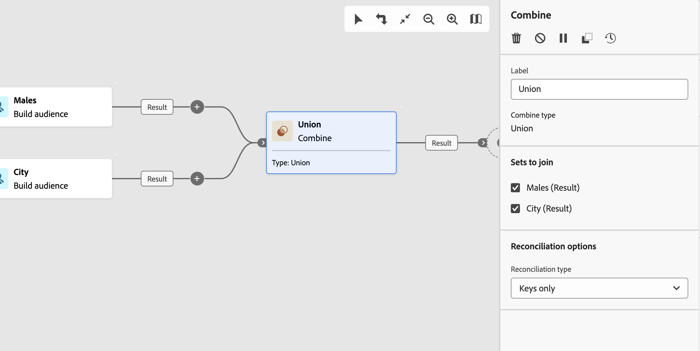
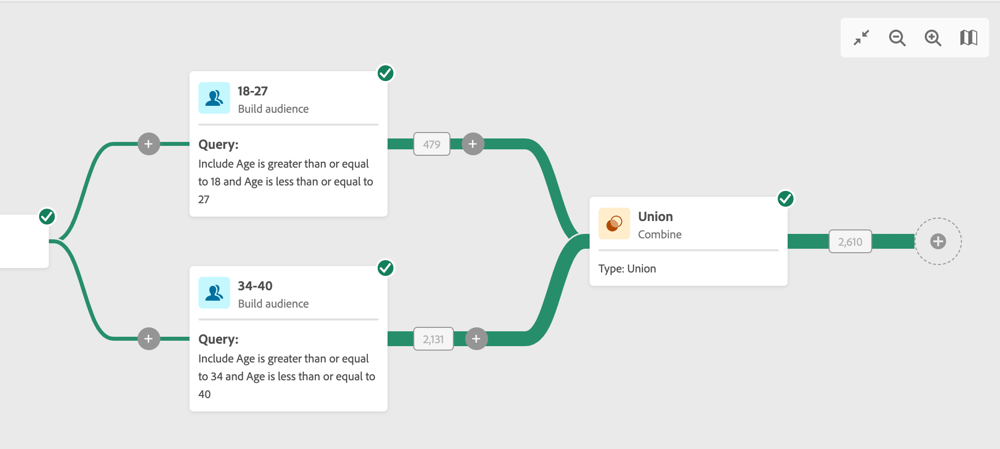

# 組合 {#combine}

>[!CONTEXTUALHELP]
>id="acw_orchestration_combine"
>title="組合活動"
>abstract="「**組合**」活動可讓您對傳入群體執行分段。您可以組合數個群體、排除其中一部分，或僅保留幾個目標通用的資料。"

**合併**&#x200B;活動是&#x200B;**鎖定目標**&#x200B;活動。 此活動則可讓您對傳入群體執行分段。您可以合併多個母體、排除部分母體，或僅保留數個目標通用的資料。 以下是可用的分段類型：

<!--
The **Combine** activity can be placed after any other activity, but not at the beginning of the workflow. Any activity can be placed after the **Combine**.
-->

* **聯合**&#x200B;會將多個活動的結果重新分組到單一目標中。
* **交集**&#x200B;只保留活動中不同入站母體的共同元素。
* **排除**&#x200B;功能會根據特定條件排除一個群體中的元素。

## 設定合併活動 {#combine-configuration}

>[!CONTEXTUALHELP]
>id="acw_orchestration_intersection_merging_options"
>title="交集合併選項"
>abstract="交集僅會保留活動中不同傳入群體通用的元素。在「要加入的集合」區段中，勾選您之前想要加入的所有活動。"

>[!CONTEXTUALHELP]
>id="acw_orchestration_exclusion_merging_options"
>title="排除合併選項"
>abstract="排除功能會根據特定條件排除一個群體中的元素。在「要加入的集合」區段中，勾選您之前想要加入的所有活動。"

>[!CONTEXTUALHELP]
>id="acw_orchestration_combine_options"
>title="選取分段類型"
>abstract="選取如何結合對象。**聯合**&#x200B;功能可以將多個活動的結果重新組合成單一目標。**交集**&#x200B;僅會保留活動中不同傳入群體通用的元素。**排除**&#x200B;功能會根據特定條件排除一個群體中的元素。"

請依照下列一般步驟設定&#x200B;**合併**&#x200B;活動：

1. 新增多個活動（例如&#x200B;**建置對象**&#x200B;活動）以形成至少兩個不同的執行分支。
1. 對上述的任一個分支新增「**組合**」活動。
1. 選取分段型別： [聯合](#union)、[交集](#intersection)或[排除](#exclusion)。
1. 按一下&#x200B;**「繼續」**。
1. 在&#x200B;**要加入的集合**&#x200B;區段中，檢查您先前要加入的所有活動。

## 聯合 {#combine-union}

>[!CONTEXTUALHELP]
>id="acw_orchestration_combine_reconciliation"
>title="調和選項"
>abstract="選取「**調和類型**」，以定義處理重複項目的方式。**索引鍵**&#x200B;選項預設為啟用，表示當來自不同傳入轉變的元素具有相同的索引鍵時，活動僅保留一個元素。使用「**欄的選取範圍**」選項來定義已套用資料調和的欄清單。"

在&#x200B;**組合**&#x200B;活動中，選取&#x200B;**調解型別**&#x200B;來設定&#x200B;**聯合**&#x200B;以定義如何處理重複專案：

* **僅金鑰**：這是預設模式。 當來自不同入站轉變的元素具有相同索引鍵時，活動只會保留一個元素。 如果入站群體是同質的，則只能使用此選項。
* **選取的欄**：選取此選項可定義套用資料協調的欄清單。 首先，選取主集（來源資料），然後選取要用於聯結的欄。

## 交集 {#combine-intersection}

>[!CONTEXTUALHELP]
>id="acw_orchestration_intersection_reconciliation_options"
>title="交集調和選項"
>abstract="選取「**調和類型**」，以定義處理重複項目的方式。**索引鍵**&#x200B;選項預設為啟用，表示當來自不同傳入轉變的元素具有相同的索引鍵時，活動僅保留一個元素。使用「**欄的選取範圍**」選項來定義已套用資料調和的欄清單。"

在&#x200B;**合併**&#x200B;活動中，請依照下列額外步驟設定&#x200B;**交集**：

1. 選取「**調節類型**」，以定義處理重複項目的方式。請參閱[聯合](#union)一節。
1. 如果要處理剩餘母體，請核取&#x200B;**產生補充**&#x200B;選項。 補碼包含所有入站活動結果減去交集的聯合。 然後，會將額外的出站轉變新增至活動。

## 排除 {#combine-exclusion}

>[!CONTEXTUALHELP]
>id="acw_orchestration_exclusion_options"
>title="排除規則"
>abstract="如有必要，請操控傳入表格。若要排除另一個維度的目標，將此目標傳回與主要目標相同的目標選擇維度。按一下「排除規則」區段中的「新增規則」，並指定維度變更條件。資料調節會透過屬性或加入執行。"

>[!CONTEXTUALHELP]
>id="acw_orchestration_combine_sets"
>title="選取要組合的集合"
>abstract="在「**要加入的集合**」一節中，從傳入轉變中選取「**主要集合**」。這是從中排除元素的集。其他集會先設定相符的元素，然後才會從主要集予以排除。"

>[!CONTEXTUALHELP]
>id="acw_orchestration_combine_exclusion"
>title="排除規則"
>abstract="如有必要，請操控傳入表格。若要排除另一個維度的目標，將此目標傳回與主要目標相同的目標選擇維度。按一下「排除規則」區段中的「新增規則」，並指定維度變更條件。資料調節會透過屬性或加入執行。"

>[!CONTEXTUALHELP]
>id="acw_orchestration_combine_complement"
>title="合併產生補集"
>abstract="切換開啟「產生補集」選項，在額外轉變中處理其餘的群體。"

在&#x200B;**合併**&#x200B;活動中，依照下列額外步驟設定&#x200B;**排除專案**：

1. 在「**要加入的集合**」一節中，從傳入轉變中選取「**主要集合**」。這是從中排除元素的集。其他集會先設定相符的元素，然後才會從主要集予以排除。
1. 如有必要，請操控傳入表格。若要排除另一個維度的目標，將此目標傳回與主要目標相同的目標選擇維度。按一下&#x200B;**排除規則**&#x200B;區段中的&#x200B;**新增規則**&#x200B;並指定維度變更條件。 資料調節會透過屬性或加入執行。
1. 如果要處理剩餘母體，請核取&#x200B;**產生補充**&#x200B;選項。 請參閱[交集](#intersection)一節。

## 範例 {#combine-examples}

在下列範例中，**組合**&#x200B;活動使用&#x200B;**Union**&#x200B;來擷取兩個查詢的所有設定檔：18至27歲的人以及34至40歲的人。

下列範例顯示兩個查詢活動之間的&#x200B;**交集**。 它會擷取年齡介於18至27歲之間，且已提供其電子郵件地址的設定檔。

下列&#x200B;**排除**&#x200B;範例顯示兩個查詢，其設定是用來篩選介於18到27歲之間且具有Adobe電子郵件網域的設定檔。 具有Adobe電子郵件網域的設定檔會從第一個集合中排除。

