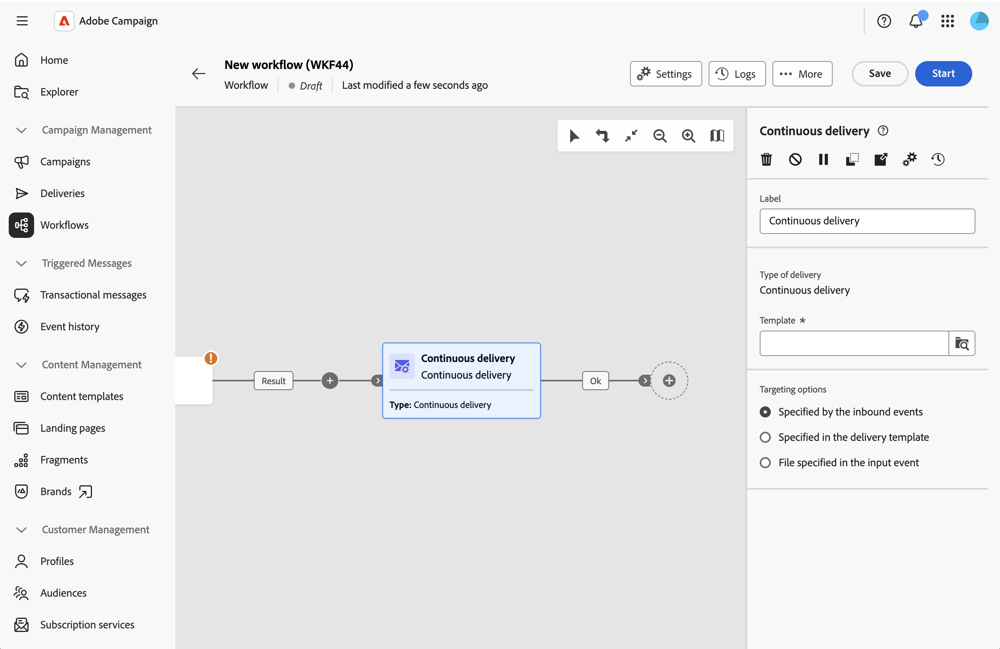

# 持續傳遞 {#continuous-delivery}

>[!CONTEXTUALHELP]
>id="acw_homepage_welcome_rn5"
>title="持續傳遞活動"
>abstract="您現在可以將新收件者新增至現有傳遞。 此傳送型別可避免每次都必須建立新傳送，因此可更有效地視需要傳送低流量警報或通知。"
>additional-url="https://experienceleague.adobe.com/docs/campaign-web/v8/release-notes/release-notes.html?lang=zh-hant" text="請參閱發行說明"

**持續傳遞**&#x200B;活動可讓您新增收件者到現有的傳遞。 此傳送型別可避免每次都必須建立新傳送，因此可更有效地視需要傳送低流量警報或通知。

持續傳遞會建立單一傳遞執行個體。 所有傳遞記錄(broadLog)和追蹤記錄都參考這個傳遞，藉此簡化監控和報告。

## 設定持續傳遞活動 {#configure}

1. 將&#x200B;**持續傳遞**&#x200B;活動新增至工作流程畫布。

   {zoomable="yes"}

1. 輸入活動的自訂&#x200B;**[!UICONTROL 標籤]** （選擇性）。 依預設，其標籤為「持續傳遞」。

1. 在&#x200B;**[!UICONTROL 範本]**&#x200B;欄位旁邊，按一下搜尋圖示以選取傳遞範本。 僅範本（非標準傳送）可供選取。 範本會定義傳遞管道、內容和設定。

1. 在&#x200B;**[!UICONTROL 目標定位選項]**&#x200B;中，選擇目標母體的定義方式：

   * **[!UICONTROL 由入站事件指定]**：目標來自入站轉變（來自上游活動，例如建置對象或增量查詢）。 這是最常見的選項。

   * **[!UICONTROL 已在傳遞範本中指定]**：目標已在範本本身中定義。

   * **[!UICONTROL 在輸入事件中指定的檔案]**：目標是由透過工作流程傳遞的檔案所提供。

持續傳遞活動會自動產生出站轉變，以繼續您的工作流程。

## 相關主題 {#related}

* [關於工作流程活動](about-activities.md)
* [電子郵件、簡訊、推播、直接郵件活動](channels.md)
* [傳遞範本](../../msg/delivery-template.md)
