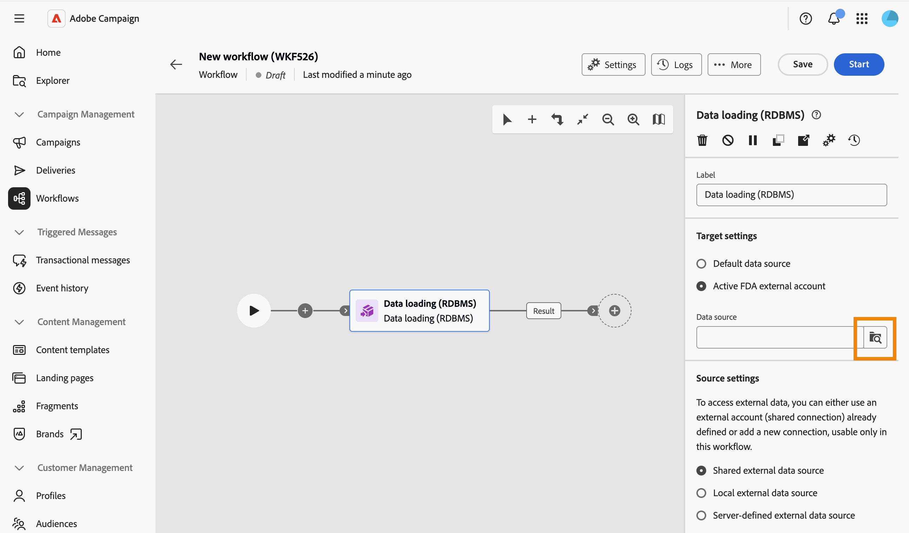
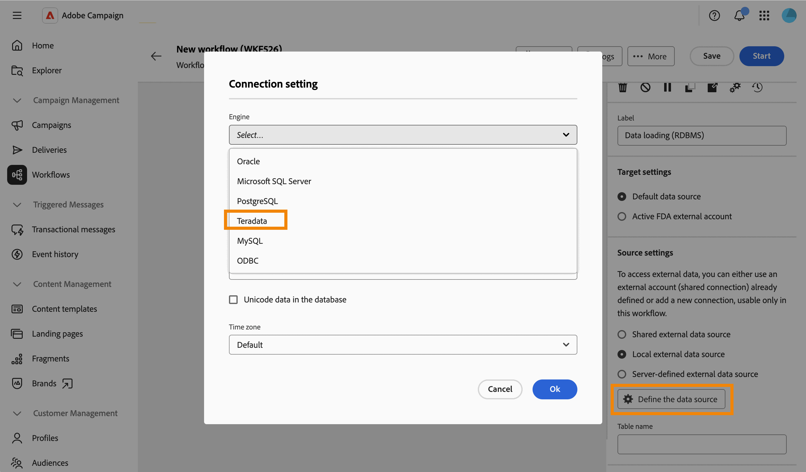

# 資料載入 (RDBMS) {#data-loading-rdbms}

>[!CONTEXTUALHELP]
>id="acw_orchestration_data_loading_rdbms"
>title="資料載入 (RDBMS) 活動"
>abstract="**資料載入 (RDBMS)** 活動是一項&#x200B;**資料管理**&#x200B;活動。 使用此活動可將資料直接從外部關聯式資料庫載入工作流程。 所擷取的資料可在整個工作流程中使用，並可用於目標市場選擇、擴充或進一步資料處理。"

**資料載入 (RDBMS)** 活動是一項&#x200B;**資料管理**&#x200B;活動。 使用此活動可將資料直接從外部關聯式資料庫載入工作流程。 所擷取的資料可在整個工作流程中使用，並可用於目標市場選擇、擴充或進一步資料處理。

<!--
This activity relies on the [Federated Data Access (FDA)](https://experienceleague.adobe.com/docs/campaign/campaign-v8/connect/fda.html){target="_blank"} option, which lets Adobe Campaign process information stored in one or more external databases without changing the structure of the Adobe Campaign data.
-->

>[!NOTE]
>
>若要改善效能，當要從外部資料庫收集的資料量允許時，請考慮改用&#x200B;**[!UICONTROL 建立對象]**&#x200B;活動（查詢型別）搭配外部資料。
>
>**[!UICONTROL 資料載入(RDBMS)]**&#x200B;活動必須是工作流程分支的第一個活動。 無法在畫布中的另一個活動之後新增它。

首先，將&#x200B;**資料載入(RDBMS)**&#x200B;活動新增為工作流程分支的第一個活動。

活動分為四個區段：

* **[!UICONTROL 目標設定]**：選擇載入資料的儲存位置。 [了解更多](#target-settings)
* **[!UICONTROL Source設定]**：選擇如何存取包含要載入之資料的外部資料庫。 [了解更多](#source-settings)
* **[!UICONTROL 收集到的資訊]**：定義從外部資料表收集哪些資料行。 [了解更多](#information-collected)
* **[!UICONTROL Source篩選]**：定義篩選條件，僅從外部資料表收集部分資料。 [了解更多](#filter)

請注意，最後兩個區段只會在定義&#x200B;**[!UICONTROL Source設定]**&#x200B;時顯示。

## 目標設定 {#target-settings}

在&#x200B;**[!UICONTROL Target設定]**&#x200B;區段中，選擇載入的資料儲存位置。 有兩個可用選項： **[!UICONTROL 預設資料來源]**&#x200B;和&#x200B;**[!UICONTROL 作用中FDA外部帳戶]**。

### 預設資料來源 {#default-data-source}

依預設，會選取此選項。 它可讓您將載入的資料儲存在預設的Campaign資料庫中。 您只需要選取選項。

### 活躍的 FDA 外部帳戶 {#active-fda-external-account}

此選項可讓您將載入的資料儲存在外部帳戶中。

1. 按一下&#x200B;**[!UICONTROL 資料來源]**&#x200B;欄位右側的按鈕。
1. 選取要使用的帳戶。

   

## 來源設定 {#source-settings}

在&#x200B;**[!UICONTROL Source設定]**&#x200B;區段中，選擇如何存取包含要載入之資料的外部資料庫。 有三個選項可供使用： **[!UICONTROL 共用外部資料來源]**、**[!UICONTROL 本機外部資料來源]**&#x200B;和&#x200B;**[!UICONTROL 伺服器定義的外部資料來源]**。

### 共用的外部資料來源 {#shared-data-source}

依預設，會選取此選項。 它可讓您使用已由Campaign管理員設定的外部帳戶。 [瞭解如何設定外部帳戶](../../administration/create-external-account.md)。

1. 按一下&#x200B;**[!UICONTROL 資料來源]**&#x200B;欄位右側的按鈕，並選取要使用的帳戶。

   

1. 按一下&#x200B;**[!UICONTROL 資料表名稱]**&#x200B;欄位旁的&#x200B;**[!UICONTROL 瀏覽]**&#x200B;按鈕，並選取包含您要載入之資料的資料表。

   

### 本機外部資料來源 {#local-external-data-source}

此選項可讓您直接在活動中定義外部資料庫的連線，僅供此工作流程中的暫時使用。 此連線不會儲存為外部帳戶。

1. 按一下&#x200B;**[!UICONTROL 定義資料來源]**&#x200B;按鈕，然後選取要連線的資料庫引擎。

   

1. 填寫針對所選引擎顯示的連線欄位。

   

<!--
1. Click **[!UICONTROL Ok]** to confirm. The button is then relabeled **[!UICONTROL Edit data source]**, allowing you to open the dialog again to change the connection settings.
-->

1. 在&#x200B;**[!UICONTROL 資料表名稱]**&#x200B;欄位中輸入要載入的資料表名稱。

### 伺服器定義的外部資料來源 {#server-defined-external-data-source}

此選項可讓您使用已在伺服器層級定義的資料庫連線。

1. 在&#x200B;**[!UICONTROL 連線名稱]**&#x200B;欄位中輸入要使用的連線名稱。
1. 在&#x200B;**[!UICONTROL 資料表名稱]**&#x200B;欄位中輸入要載入的資料表名稱。

   

## 收集的資訊 {#information-collected}

設定資料表後，**[!UICONTROL 收集到的資訊]**&#x200B;區段可讓您定義從外部資料表收集哪些資料行：

1. 如果您需要收集所選資料表的每個資料行，請核取&#x200B;**[!UICONTROL 保留所有來源資料]**&#x200B;選項（預設）。
1. 按一下[新增資料行]以擷取&#x200B;]**，改為收集特定資料行，或另外收集。**[!UICONTROL 

   

<!--
In the **[!UICONTROL Select attribute]** dialog, scoped to the schema of the selected table, pick an attribute and confirm. [Learn how to select attributes and add them to favorites](../../get-started/attributes.md)
-->

1. 選取屬性並確認。 將屬性新增為具有&#x200B;**[!UICONTROL Column]**&#x200B;欄位和可編輯的&#x200B;**[!UICONTROL Label]**&#x200B;欄位的列。 使用刪除圖示可將其移除。

   

<!--
## Link to another table (optional) {#link}

NOT CONFIRMED — restore and verify before publishing.

Source: transcript of the ACC Web UI - Handsoff 12-06 demo (Herve Phulpin, ~20:49-21:04 mark). At the time of that demo, this part of the activity was explicitly described as unfinished: "the next part is not yet available", "this part is missing", "we are not able to add a link condition". No screenshot of a completed, working flow for this section has been captured since. Two related sub-bugs were still open against NEO-95826 at last check: NEO-97147 ("DBMS activity transition results not shown") and NEO-97148 ("local external data table name is not a picker").

If you need to reconcile the loaded data with an existing table, such as the Recipients table, add a link:

1. Click **Add link**.
1. Select the table to link to. You can browse tables from the Campaign database or from the external data source.
1. Define the join condition between the loaded table and the target table:
   * Simple join: Select the attributes to match between the two tables.
   * Advanced join: Use the query modeler to build the join condition.

[Learn more about link definitions in the Enrichment activity](enrichment.md#create-links).
-->

## Source篩選（選用） {#filter}

若要僅從外部表格收集部分資料，您可以定義篩選器：

1. 在&#x200B;**[!UICONTROL Source篩選]**&#x200B;區段中，按一下&#x200B;**[!UICONTROL 編輯查詢]**。

   

1. 查詢建模器會在專用熒幕上開啟，其範圍為所選表格的綱要。 用它來建置表格屬性的條件。 [瞭解如何使用查詢模型工具](../../query/query-modeler-overview.md)

   

<!--
>[!NOTE]
>
>Some advanced options available for this activity in the client console, such as computing the table name from the inbound transition, are not yet exposed in the Campaign Web User Interface.
-->