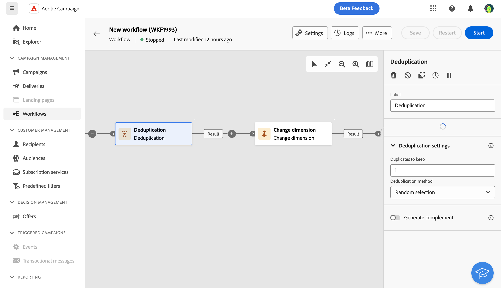
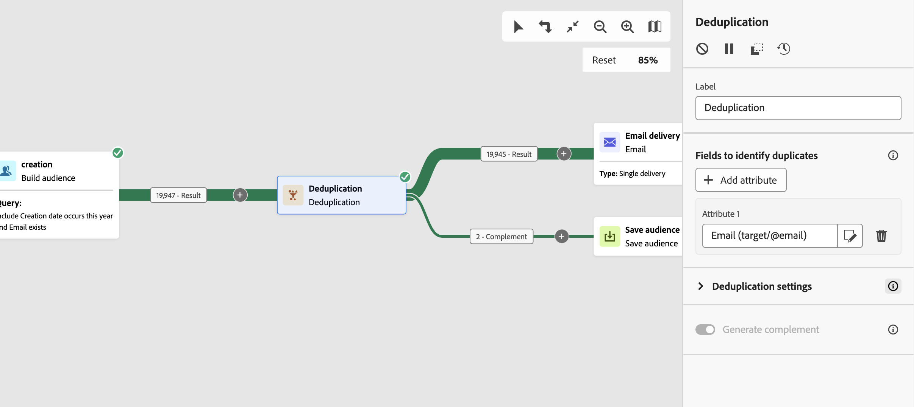

# 重複資料刪除 {#deduplication}

>[!CONTEXTUALHELP]
>id="acw_orchestration_deduplication_fields"
>title="用於識別重複資料的欄位"
>abstract="在&#x200B;**識別重複專案的欄位**&#x200B;區段中，按一下&#x200B;**新增屬性**&#x200B;按鈕，指定相同值允許識別重複專案的欄位，例如電子郵件地址、名字和姓氏。 欄位順序會指定要先處理的欄位。"

>[!CONTEXTUALHELP]
>id="acw_orchestration_deduplication"
>title="重複資料刪除活動"
>abstract="**重複資料刪除**&#x200B;活動會刪除傳入活動結果中的重複專案。 它通常用於目標定位活動之後，以及使用目標定位資料的活動之前。"

>[!CONTEXTUALHELP]
>id="acw_orchestration_deduplication_complement"
>title="產生補集"
>abstract="您可以產生額外的出站轉變，並將剩餘母體排除為重複專案。 為此，請開啟「**產生補集**」選項。"

>[!CONTEXTUALHELP]
>id="acw_orchestration_deduplication_settings"
>title="重複資料刪除 - 重複設定"
>abstract="若要刪除傳入資料中的重複項目，請在以下欄位中定義重複項目刪除方法。預設只會保留一筆記錄。根據運算式或屬性選取重複資料刪除模式。 預設會隨機選取要避免重複的記錄。"

**重複資料刪除**&#x200B;活動是&#x200B;**鎖定目標**&#x200B;活動。 此活動會刪除入站活動結果中的重複專案，例如收件者清單中的重複設定檔。 **重複資料刪除**&#x200B;活動通常用於目標定位活動之後，以及使用目標定位資料的活動之前。

## 設定重複資料刪除活動 {#deduplication-configuration}

請依照下列步驟設定&#x200B;**重複資料刪除**&#x200B;活動：

1. 將&#x200B;**重複資料刪除**&#x200B;活動新增至工作流程。

1. 在&#x200B;**識別重複專案的欄位**&#x200B;區段中，按一下&#x200B;**新增屬性**&#x200B;按鈕，指定相同值允許識別重複專案的欄位，例如電子郵件地址、名字和姓氏。 欄位順序會指定要先處理的欄位。 [瞭解如何選取屬性並將其新增至我的最愛](../../get-started/attributes.md)。

1. 在&#x200B;**重複資料刪除設定**&#x200B;區段中，選取要保留的不重複&#x200B;**重複專案數目**。 此欄位的預設值為 1。值0會保留所有重複專案。

   例如，如果記錄A和B被視為記錄Y的重複專案，而記錄C被視為記錄Z的重複專案：

   * 如果該欄位的值為 1：僅保留 Y 和 Z 記錄。
   * 如果該欄位的值為 0：會保留所有記錄。
   * 如果欄位的值為2：會保留記錄C和Z，並保留A、B和Y中的兩條記錄，這是偶然的或取決於選取的重複資料刪除方法。

1. 選取要使用的&#x200B;**重複資料刪除方法**：

   * **隨機選取**：隨機選取要保留在重複專案外的記錄。
   * **使用運算式**：保留輸入運算式的值最小或最大的記錄。
   * **非空白值**：保留運算式不是空白的記錄。
   * **依循值清單**：定義一或多個欄位的值優先順序。 若要定義值，請按一下&#x200B;**屬性**&#x200B;來選取欄位或建立運算式，然後將值新增至適當的資料表。 若要定義新欄位，請按一下值清單上方的&#x200B;**新增**&#x200B;按鈕。

1. 核取&#x200B;**產生補充**&#x200B;選項，以利用剩餘母體。 補充包含所有重複專案。 然後，會將額外的轉變新增至活動。

## 範例 {#deduplication-example}

在下列範例中，使用重複資料刪除活動，在傳送傳遞之前從目標中排除重複專案。 識別的重複設定檔會新增到專用受眾，必要時可重複使用。 選擇&#x200B;**電子郵件**&#x200B;地址以識別重複專案。 保留1個專案，並選取&#x200B;**隨機**&#x200B;重複資料刪除方法。

