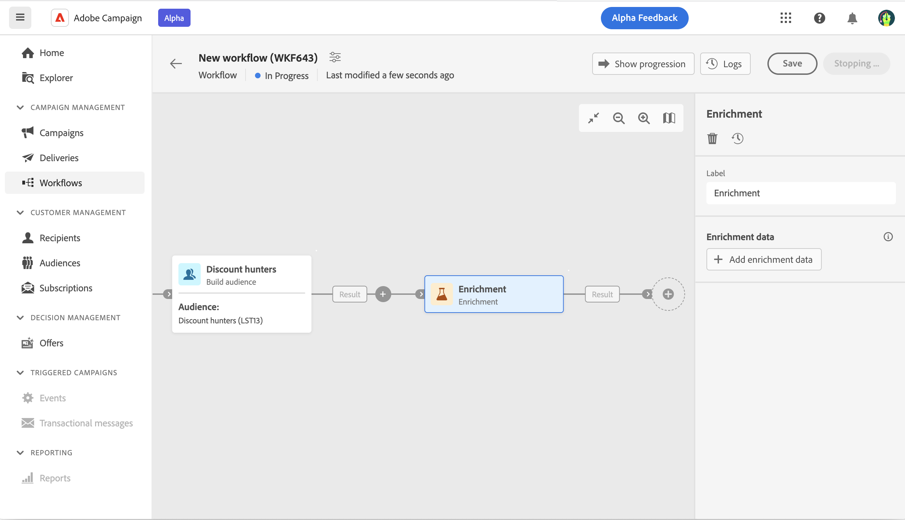
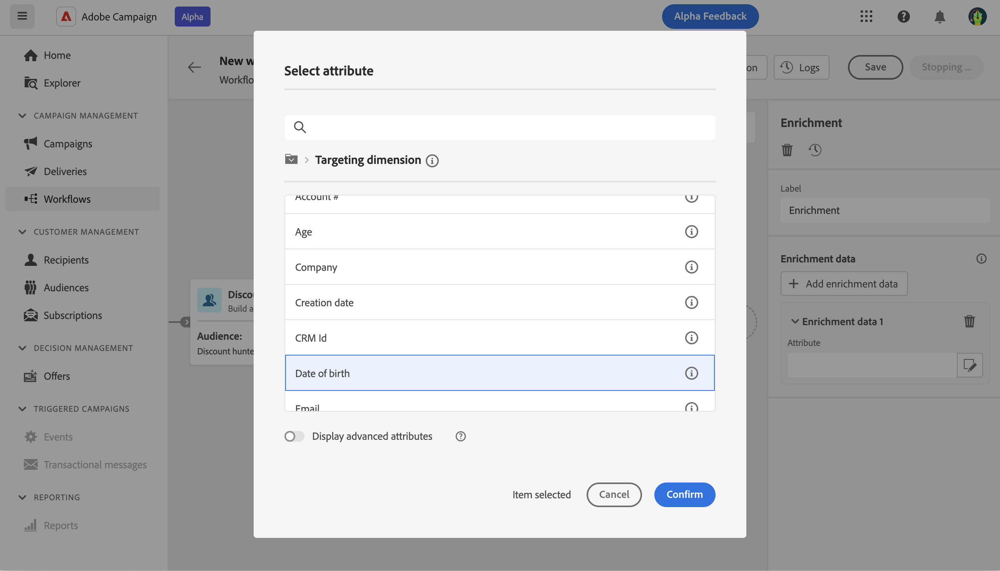
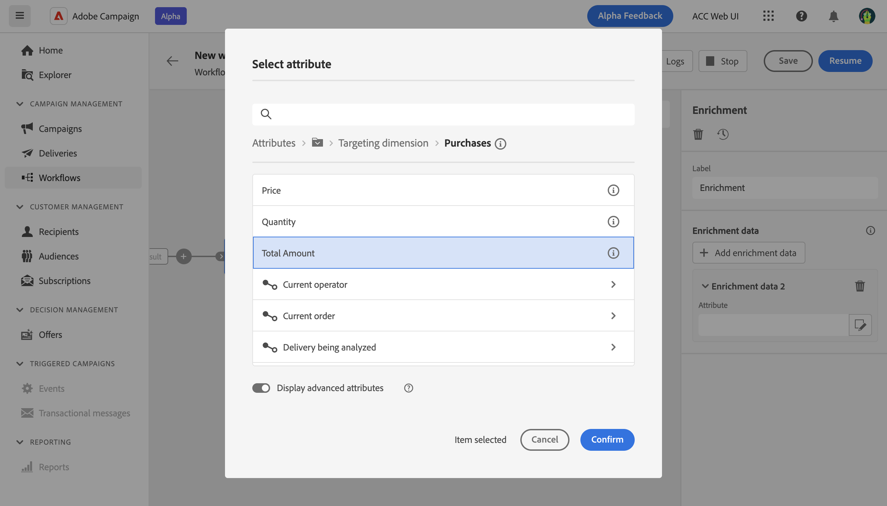
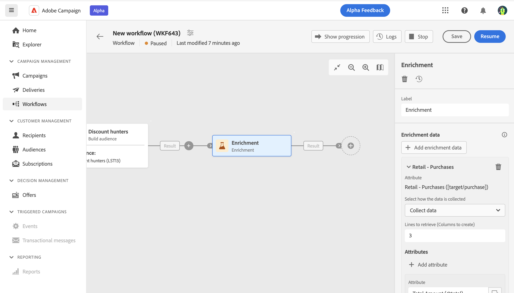
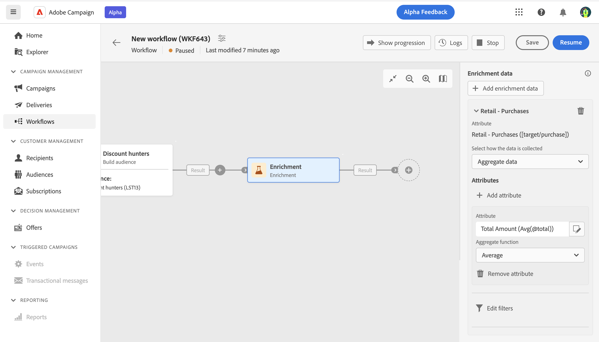
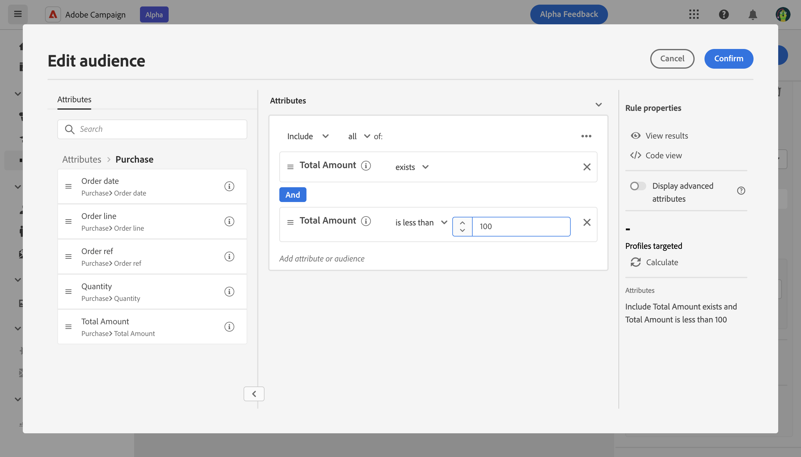
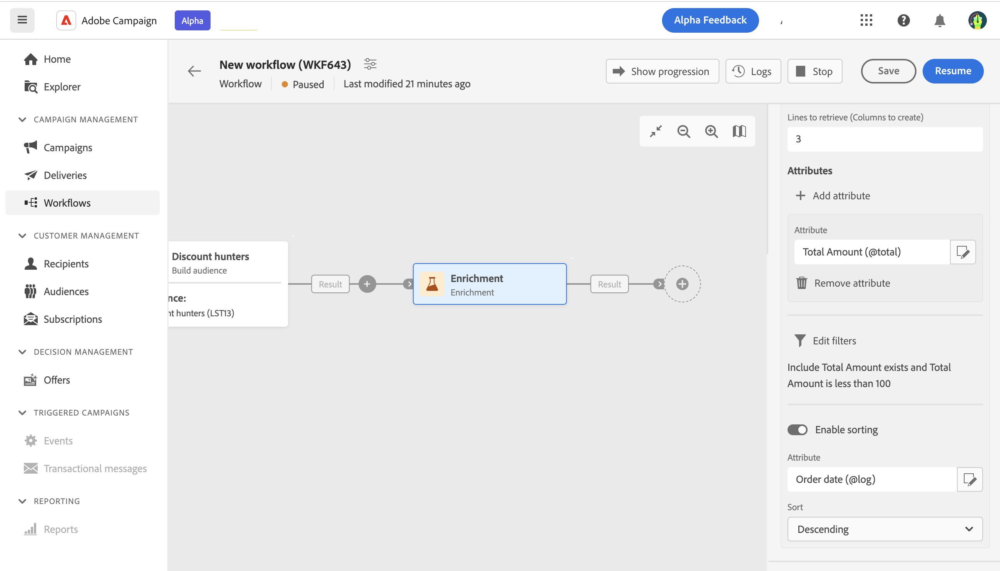

# 擴充 {#enrichment}

>[!CONTEXTUALHELP]
>id="acw_orchestration_enrichment_data"
>title="擴充活動"
>abstract="擴充活動可讓您使用資料庫中的其他資訊來增強目標資料。它通常用於目標定位活動之後的工作流程。 將擴充資料新增到工作流程後，它可以用於在擴充活動之後新增的活動中，根據客戶的行為、偏好和需求將客戶分成不同群組，或是用於建立最有可能讓目標對象產生共鳴的個人化行銷訊息和行銷活動。"

此 **擴充** 活動是 **目標定位** 活動。 它可讓您使用資料庫中的其他資訊來增強目標資料。 它通常用於分段活動後的工作流程。

擴充資料可以：

* **來自相同工作表**，作為您工作流程中的目標：

   *以一組客戶為目標，並新增「生日」欄位到目前工作表*

* **來自另一個工作表**：

   *以一組客戶為目標，並新增來自「購買」表格的「數量」和「產品類型」欄位*。

擴充資料新增至工作流程後，即可用於新增至後的活動。 **擴充** 根據客戶行為、偏好和需求將客戶劃分為不同群組的活動，或是建立更可能引起目標受眾共鳴的個人化行銷訊息和行銷活動。

例如，您可以將與客戶購買行為相關資訊新增到工作流程的工作表中，並使用此資料根據客戶上次購買行為或消費金額來個人化電子郵件。

## 一般設定

請依照下列步驟設定 **擴充** 活動：

1. 新增活動，例如 **建立對象** 和 **合併** 活動。
1. 新增 **擴充** 活動。
1. 按一下 **新增擴充資料**.

您可以選取兩種型別的資料：目標維度的單一屬性或集合連結。

## 單一屬性

在此處，我們只是新增單一擴充屬性，例如出生資料。 請按照以下步驟操作：

1. 按一下 **屬性** 欄位。
1. 從目標維度選取簡單欄位，在我們的範例中是出生日期。
1. 按一下「**確認**」。

## 集合連結

在這個更複雜的使用案例中，我們將選取一個集合連結，此連結具有表格之間的1-N基數。 讓我們擷取少於100美元的最新三次購買。 為此，您需要定義：

* 屬性： **總金額** 欄位
* 要擷取的行數： 3
* 篩選器：篩選掉大於100$的專案
* a排序：下級排序 **訂購日期** 欄位。

請按照以下步驟操作：

### 新增屬性

您可以在此處選取收集連結，以作為擴充資料。

1. 按一下 **屬性** 欄位。
1. 按一下 **顯示進階屬性**.
1. 選取 **總金額** 欄位來自 **購買** 表格。

### 定義集合設定

然後，定義資料收集方式以及要擷取的記錄數。

1. 選取 **收集資料** 在 **選取收集資料的方式** 下拉式清單。
1. 在「 」中輸入「3」 **要擷取的行（要建立的欄）** 欄位。

舉例來說，如果您想要取得客戶的平均購買量，請選取「 」 **彙總資料** 而是，並選取 **平均** 在 **彙總函式** 下拉式清單。

### 定義篩選器

在此，我們定義屬性的最大值。 我們會篩選掉大於100$的專案。

1. 按一下 **編輯篩選器**.
1. 新增下列兩個篩選器： **總金額** 存在和 **總金額** 小於100。 第一個會篩選NULL值，因為它們會顯示為最大值。
1. 按一下「**確認**」。

### 定義排序

我們現在需要套用排序以擷取這三個專案 **最新** 購買。

1. 啟動 **啟用排序** 選項。
1. 按一下 **屬性** 欄位。
1. 選取 **訂購日期** 欄位。
1. 按一下「**確認**」。
1. 選取 **降序** 從 **排序** 下拉式清單。

<!--
cardinality between the tables (1-N)
1. select attribute to use as enrichment data

    display advanced fields option
    i button

    note: attributes from the target dimension

1. Select how the data is collected
1. number of records to retrieve if want to retrieve a collection of multiple records
1. Apply filters and build rule

    select an existing filter
    save the filter for reuse
    view results of the filter visually or in code view

1. sort records using an attribute

leverage enrichment data in campaign

where we can use the enrichment data: personalize email, other use cases?

## Example

-->