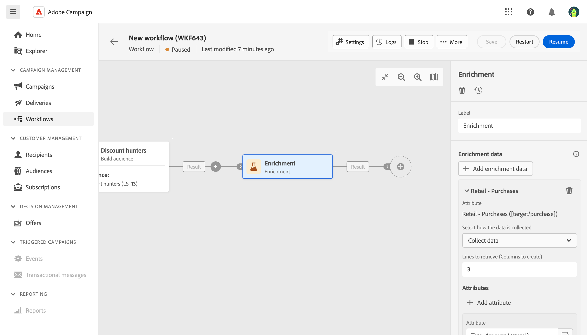

# 擴充 {#enrichment}

>[!CONTEXTUALHELP]
>id="acw_orchestration_enrichment"
>title="擴充活動"
>abstract="「**擴充活動**」可讓您使用資料庫中的其他資訊來增強目標資料。這通常會用於分段活動之後的工作流程。"

>[!CONTEXTUALHELP]
>id="acw_orchestration_enrichment_data"
>title="擴充活動"
>abstract="將擴充資料新增到工作流程後，它可以用於在擴充活動之後新增的活動中，根據客戶的行為、偏好和需求將客戶分成不同群組，或是用於建立最有可能讓目標對象產生共鳴的個人化行銷訊息和行銷活動。"

>[!CONTEXTUALHELP]
>id="acw_orchestration_enrichment_simplejoin"
>title="連結定義"
>abstract="在工作表資料和 Adobe Campaign 資料庫之間建立連結。例如，如果您從包含收件者的帳號、國家/地區和電子郵件的檔案載入資料，您必須建立指向國家/地區表的連結，才能更新其個人資料中的此資訊。"

>[!CONTEXTUALHELP]
>id="acw_orchestration_enrichment_reconciliation"
>title="擴充調和"
>abstract="擴充調和"

>[!CONTEXTUALHELP]
>id="acw_targetdata_personalization_enrichmentdata"
>title="擴充資料"
>abstract="選取用於擴充工作流程的資料。您可以選取兩種類型的擴充資料：目標維度中的單一擴充屬性，或集合連結 (即表格之間具有 1-N 基數的連結)。"

「**擴充**」活動是一種「**目標定位**」活動。此活動可讓您使用資料庫中的其他資訊來增強目標資料。這通常會用於分段活動之後的工作流程。

擴充資料可以：

* **來自相同工作表**，作為您工作流程中的目標：

  *鎖定一組客戶，並將「出生日期」欄位新增至目前工作表*.

* **來自另一個工作表**：

  *以一組客戶為目標，並新增來自「購買」表格的「數量」和「產品類型」欄位*。

擴充資料新增至工作流程後，即可用於新增至後的活動。 **擴充** 根據客戶行為、偏好和需求將客戶劃分為不同群組的活動，或建立個人化行銷訊息和行銷活動，以便更可能引起目標受眾的共鳴。

例如，您可以將與客戶購買行為相關資訊新增到工作流程的工作表中，並使用此資料根據客戶上次購買行為或消費金額量身訂製電子郵件。

## 新增擴充活動 {#enrichment-configuration}

請按照以下步驟設定&#x200B;**擴充**&#x200B;活動：

1. 新增活動，例如「**建置對象**」和「**組合**」活動。
1. 新增「**擴充**」活動。
1. 如果您的工作流程中已設定多個轉變，您可以使用 **[!UICONTROL 主要集]** 定義哪一個轉變應作為主要集以擴充資料的欄位。

## 新增擴充資料 {#enrichment-add}

1. 按一下 **新增擴充資料** 並選取要用來擴充資料的屬性。

   您可以選取兩種擴充資料：來自目標維度的單一擴充屬性，或集合連結。 以下範例詳細說明了每種型別：
   * [單一擴充屬性](#single-attribute)
   * [集合連結](#collection-link)

   >[!NOTE]
   >
   >此 **編輯運算式按鈕** 在「屬性選取」畫面中，您可以建置進階運算式來選取屬性。 [瞭解如何使用運算式編輯器](../../query/expression-editor.md)

   

## 建立表格之間的連結 {#create-links}

>[!CONTEXTUALHELP]
>id="acw_homepage_welcome_rn3"
>title="表格之間的連結"
>abstract="現在您可以在擴充工作流程活動中建立工作表資料和 Adobe Campaign 資料庫之間的連結。"
>additional-url="https://experienceleague.adobe.com/docs/campaign-web/v8/release-notes/release-notes.html?lang=zh-Hant" text="請參閱版本注意事項"

此 **[!UICONTROL 連結定義]** 區段可讓您在工作表格資料與Adobe Campaign資料庫之間建立連結。 例如，如果您從包含收件者的帳號、國家/地區和電子郵件的檔案載入資料，您必須建立指向國家/地區表的連結，才能更新其個人資料中的此資訊。

有數種可用的連結型別：

* **[!UICONTROL 1個基數簡易連結]**：來自主要集的每個記錄都可以與來自連結資料的一個及唯一一個記錄相關聯。
* **[!UICONTROL 0或1個基數簡單連結]**：來自主要集的每個記錄都可以與來自連結資料的0或1個記錄相關聯，但不能與多個記錄相關聯。
* **[!UICONTROL N基數集合連結]**：來自主要集的每個記錄都可以與來自連結資料的0、1或更多(N)記錄相關聯。

若要建立連結，請依照下列步驟進行：

1. 在 **[!UICONTROL 連結定義]** 區段，按一下 **[!UICONTROL 新增連結]** 按鈕。

   

1. 在 **關係型別** 從下拉式清單中，選擇要建立的連結型別。

1. 識別您要將主要集連結到的目標：

   * 若要連結資料庫中的現有表格，請選擇 **[!UICONTROL 資料庫結構描述]** 並從中選擇所需的表格 **[!UICONTROL 目標結構描述]** 欄位。
   * 若要與輸入轉變中的資料連結，請選擇 **臨時結構描述** 並選取您要使用其資料的轉變。

1. 定義調解准則，將來自主要集的資料與連結的結構描述相符。 可用的聯結型別有兩種：

   * **簡單聯結**：選取特定屬性，以比對兩個結構描述中的資料。 按一下 **新增聯結** 並選取 **來源** 和 **目的地** 要作為調解條件的屬性。
   * **進階聯結**：使用進階條件建立聯結。 按一下 **新增聯結** 並按一下 **建立條件** 按鈕以開啟查詢建模器。

有關使用連結的工作流程範例，請參閱 [範例](#link-example) 區段。

## 範例 {#example}

### 單一擴充屬性 {#single-attribute}

在這裡，我們只新增單一擴充屬性，例如出生日期。請按照以下步驟操作：

1. 按一下「**屬性**」欄位內部。
1. 在目標定位維度中選取一個簡單的欄位，在範例中是出生日期。
1. 按一下「**確認**」。

### 集合連結 {#collection-link}

在這個較複雜的使用案例中，我們要選取集合連結，這是表格之間具有 1-N 基數的連結。讓我們擷取最近三筆低於 100 美元的購買。為了這麼做，您需要定義：

* 擴充屬性：「**總金額**」欄位
* 要擷取的行數：3
* 篩選：篩除大於 100 美元的項目
* 排序：「**訂購日期**」欄位的遞減排序。

#### 新增此屬性 {#add-attribute}

您可以在此處選取用作擴充資料的集合連結。

1. 按一下「**屬性**」欄位內部。
1. 按一下「**顯示進階屬性**」。
1. 選取「**總金額**」欄位 (在「**購買**」表格中)。

#### 定義集合設定{#collection-settings}

然後，定義收集資料的方式以及要擷取的記錄數。

1. 選取「**集合資料**」(從「**選取收集資料的方式**」下拉選單)。
1. 在「**要擷取的行 (要建立的欄)**」欄位輸入「3」。

例如，如果您想要取得某個客戶的平均購買金額，請改為選取「**彙總資料**」，然後選取「**平均**」(從「**彙總函數**」下拉選單)。

#### 定義篩選條件{#collection-filters}

在這裡，我們可定義擴充屬性的最大值。我們會篩選掉大於100$的專案。 [瞭解如何使用查詢建模器](../../query/query-modeler-overview.md)

1. 按一下「**編輯篩選條件**」。
1. 新增以下兩個篩選條件：「**總金額**&#x200B;存在」以及「**總金額**&#x200B;小於 100」。第一個會篩選出 NULL 值，因為這會顯示為最大值。
1. 按一下「**確認**」。

#### 定義排序{#collection-sorting}

我們現在需要套用排序，以擷取三筆&#x200B;**最近的**&#x200B;購買。

1. 啟動「**啟用排序**」選項。
1. 按一下「**屬性**」欄位內部。
1. 選取「**訂購日期**」欄位。
1. 按一下「**確認**」。
1. 選取「**遞減**」(從「**排序**」下拉選單)。

### 使用連結的資料擴充 {#link-example}

以下範例顯示一個工作流程，其設定為在兩個轉變之間建立連結。 第一個轉變使用查詢活動定位設定檔資料，而第二個轉變包括儲存在透過載入檔案活動載入的檔案中的購買資料。

* 第一個 **擴充** 活動連結我們的主要集(資料來自 **查詢** 活動)中的結構描述 **載入檔案** 活動。 這可讓我們將查詢定位的每個設定檔與對應的購買資料進行比對。
* 秒 **擴充** 新增活動，以使用來自的購買資料擴充工作流程表格的資料 **載入檔案** 活動。 這可讓我們在後續活動中使用這些資料，例如，個人化傳送給客戶的訊息，其中包含客戶購買的相關資訊。

  

<!--

Add other fields
use it in delivery

cardinality between the tables (1-N)
1. select attribute to use as enrichment data

    display advanced fields option
    i button

    note: attributes from the target dimension

1. Select how the data is collected
1. number of records to retrieve if want to retrieve a collection of multiple records
1. Apply filters and build rule

    select an existing filter
    save the filter for reuse
    view results of the filter visually or in code view

1. sort records using an attribute

leverage enrichment data in campaign

where we can use the enrichment data: personalize email, other use cases?

## Example

-->
