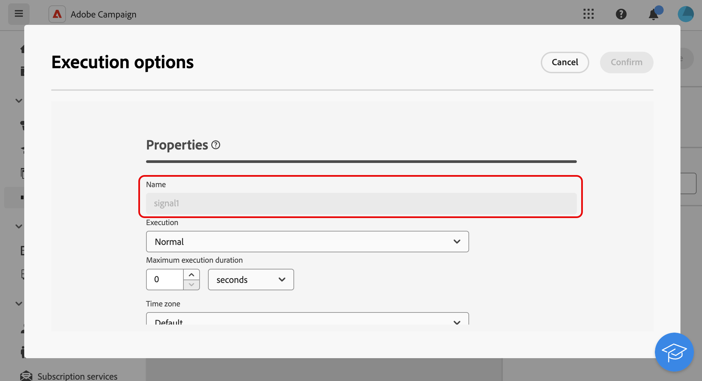

# 外部訊號 {#external-signal}

<!--External Signal End-->

>[!CONTEXTUALHELP]
>id="acw_orchestration_externalsignal"
>title="外部訊號"
>abstract="此 **外部訊號** 活動可讓您從另一個工作流程或API呼叫觸發工作流程的執行。"

>[!CONTEXTUALHELP]
>id="acw_orchestration_externalsignal_parameters"
>title="外部訊號參數"
>abstract="外部訊號參數"

>[!CONTEXTUALHELP]
>id="acw_orchestration_end_trigger"
>title="結束觸發程序"
>abstract="結束觸發程序"

此 **外部訊號** 活動是 **流量控制** 活動。 它可讓您從其他工作流程或API呼叫觸發工作流程的執行。

>[!NOTE]
>
>本頁面說明設定「 」的主要步驟 **[!UICONTROL 外部訊號]** Campaign Web使用者介面中的活動，並從其他工作流程或API呼叫觸發。 有關如何觸發工作流程及其最佳實務，以及如何使用Campaign API的詳細資訊，請參閱 [Campaign v8 （使用者端主控台）檔案](https://experienceleague.adobe.com/en/docs/campaign/automation/workflows/advanced-management/javascript-in-workflows#trigger-example)

請依照下列步驟設定 **外部訊號** 活動並觸發其執行：

1. 新增 **外部訊號** 活動放入工作流程。

1. 完成工作流程的設定並開始執行。 此 **[!UICONTROL 外部訊號]** 活動顯示為「擱置中」，等待觸發。

   

1. 擷取以下資訊：

   * 此 **工作流程的內部名稱**，會在其標籤旁邊顯示。

     +++檢視範例

     

+++

   * 此 **外部訊號活動的名稱**，顯示在工作流程的 **[!UICONTROL 執行選項]**.

     +++檢視範例

     

+++

1. 若要觸發工作流程，您必須執行 `PostEvent` JavaScript函式。 此函式可讓您使用所選的值傳遞變數，並在觸發的工作流程中運用這些變數。

   此 `PostEvent` 函式可從其他工作流程或API呼叫執行。

   * 觸發 **[!UICONTROL 外部訊號]** 活動，從執行PostEvent函式 **[!UICONTROL 初始化指令碼]** 窗格，可從活動的 **[!UICONTROL 執行選項]**. 對於 **[!UICONTROL javascript程式碼]** 活動，從活動的指令碼執行函式。

     語法如下：

     ```
     xtk.workflow.PostEvent("<workflow-internal-name>","<signal-activity-name>","",<variables <variable-name>="<value>"/>, false);
     ```

   +++檢視範例

   在此範例中，我們將觸發「signal1」外部訊號活動，該活動已新增至其內部名稱為「WKF12345」的工作流程。 我們也會傳遞名為「customID」的變數，其值為「123456」。

   

+++

   * 觸發 **[!UICONTROL 外部訊號]** 活動，請依照Campaign API檔案中詳述的步驟操作。 [瞭解如何使用靜態 `PostEvent` 方法](https://experienceleague.adobe.com/developer/campaign-api/api/sm-workflow-PostEvent.html)
