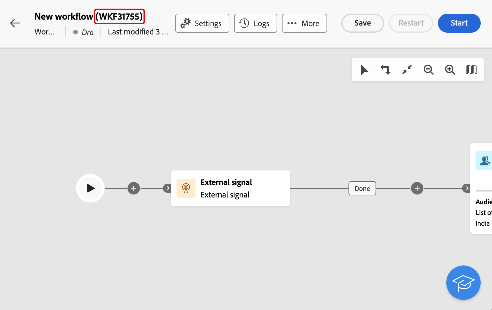
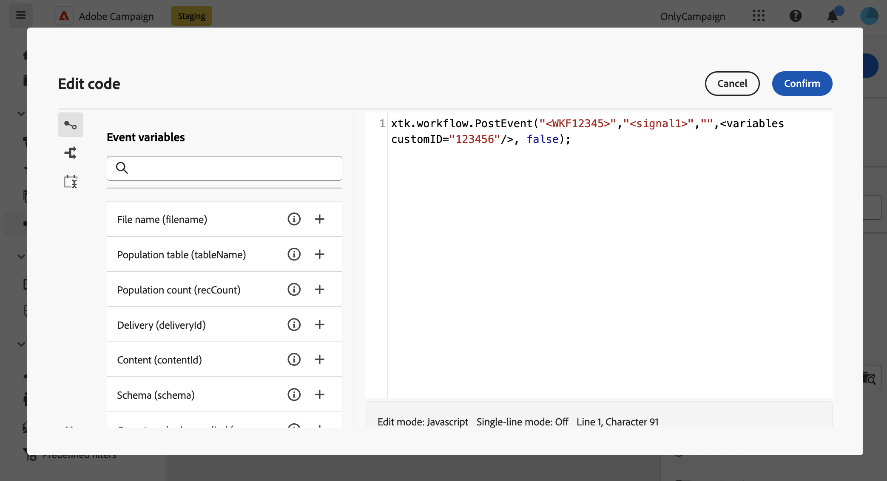

# 外部訊號 {#external-signal}

<!--External Signal End-->

>[!CONTEXTUALHELP]
>id="acw_orchestration_externalsignal"
>title="外部訊號"
>abstract="「**外部訊號**」活動可讓您從其他工作流程或 API 呼叫觸發工作流程的執行。"

>[!CONTEXTUALHELP]
>id="acw_orchestration_externalsignal_parameters"
>title="外部訊號參數"
>abstract="外部訊號參數"

>[!CONTEXTUALHELP]
>id="acw_orchestration_end_trigger"
>title="結束觸發程序"
>abstract="結束觸發程序"

**外部訊號**&#x200B;活動是&#x200B;**流量控制**&#x200B;活動。 它可讓您從另一個工作流程或API呼叫觸發工作流程的執行。

>[!NOTE]
>
>此頁面說明在Campaign網頁使用者介面中設定&#x200B;**[!UICONTROL 外部訊號]**&#x200B;活動，並從其他工作流程或API呼叫觸發該活動的主要步驟。 有關如何觸發工作流程、最佳實務以及如何使用Campaign API的詳細資訊，請參閱[Campaign v8 （使用者端主控台）檔案](https://experienceleague.adobe.com/en/docs/campaign/automation/workflows/advanced-management/javascript-in-workflows#trigger-example)。

請依照下列步驟設定&#x200B;**外部訊號**&#x200B;活動並觸發其執行：

1. 將&#x200B;**外部訊號**&#x200B;活動新增至您的工作流程。

1. 完成工作流程的設定，並開始執行。 **[!UICONTROL 外部訊號]**&#x200B;活動顯示為「擱置中」，等待觸發。

   

1. 擷取下列資訊：

   * **工作流程的內部名稱**，會顯示在其標籤旁。

     +++檢視範例

     

     +++

   * **外部訊號活動的名稱**，顯示在工作流程的&#x200B;**[!UICONTROL 執行選項]**&#x200B;中。

     +++檢視範例

     ![熒幕擷圖顯示[執行]選項中的[外部訊號]活動名稱。](../assets/external-signal-name.png)

     +++

1. 若要觸發工作流程，請執行`PostEvent` JavaScript函式。 此函式可讓您使用您選擇的值傳遞變數，並在觸發的工作流程中使用它們。

   `PostEvent`函式可從其他工作流程或API呼叫執行。

   * 若要從工作流程觸發&#x200B;**[!UICONTROL 外部訊號]**&#x200B;活動，請從&#x200B;**[!UICONTROL 初始化指令碼]**&#x200B;窗格執行PostEvent函式，可從活動的&#x200B;**[!UICONTROL 執行選項]**&#x200B;存取。 針對&#x200B;**[!UICONTROL JavaScript程式碼]**&#x200B;活動，從活動的指令碼執行函式。

     語法如下：

     ```
     xtk.workflow.PostEvent("<workflow-internal-name>","<signal-activity-name>","",<variables <variable-name>="<value>"/>, false);
     ```

   +++檢視範例

   在此範例中，會觸發「signal1」外部訊號活動。 已將其新增至內部名稱為「WKF12345」的工作流程。 名為「customID」的變數會以「123456」值傳遞。

   

   +++

   * 若要從API呼叫觸發&#x200B;**[!UICONTROL 外部訊號]**&#x200B;活動，請依照Campaign API檔案中詳述的步驟操作。 [瞭解如何使用靜態`PostEvent`方法](https://experienceleague.adobe.com/developer/campaign-api/api/sm-workflow-PostEvent.html)。