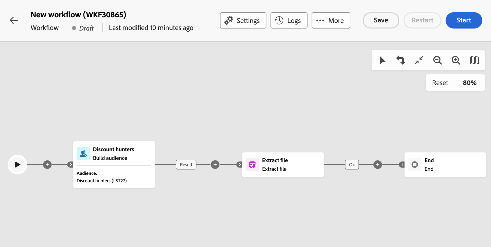
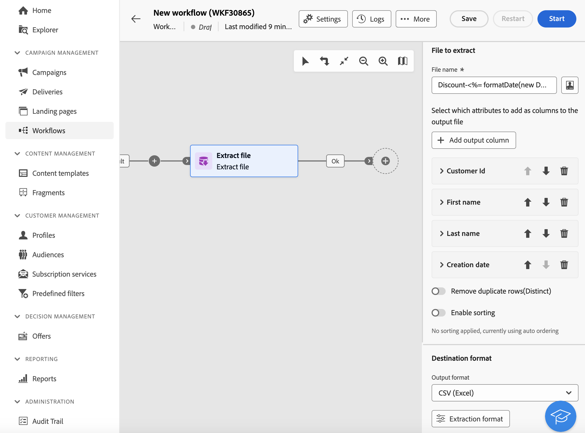

# 擷取檔案 {#extract-file}

>[!CONTEXTUALHELP]
>id="acw_orchestration_extractfile"
>title="擷取檔案"
>abstract="「**擷取檔案**」活動可讓您從 Adobe Campaign 以外部檔案的形式匯出資料。然後可以使用「傳輸檔案」活動將資料匯出到伺服器位置，例如 SFTP、雲端儲存空間或您的行銷活動伺服器。"

**擷取檔案**&#x200B;活動是&#x200B;**資料管理**&#x200B;活動。 使用此活動，以外部檔案的形式從Adobe Campaign匯出資料。 然後可以使用「傳輸檔案」活動將資料匯出到伺服器位置，例如 SFTP、雲端儲存空間或您的行銷活動伺服器。

若要設定&#x200B;**擷取檔案**&#x200B;活動，請新增&#x200B;**擷取檔案**&#x200B;活動至您的工作流程，然後遵循下列步驟。

## 設定要摘取的檔案 {#extract-configuration}

>[!CONTEXTUALHELP]
>id="acw_orchestration_extractfile_file"
>title="要擷取的檔案"
>abstract="選取要擷取的檔案。"

要擷取的&#x200B;**[!UICONTROL 檔案]**&#x200B;區段可讓您設定要包含的檔案屬性和資料。

1. 在&#x200B;**[!UICONTROL 檔案名稱]**&#x200B;欄位中，輸入要擷取的檔案名稱。

   您可以使用事件變數、條件和日期/時間函式，個人化檔案名稱。 若要這麼做，請按一下&#x200B;**[!UICONTROL 開啟個人化對話方塊]**&#x200B;圖示以開啟運算式編輯器。 [瞭解如何使用事件變數和運算式編輯器](../event-variables.md)。

1. 指定要顯示在擷取檔案中的欄。 要執行此操作，請依照下列步驟執行：

   1. 按一下&#x200B;**[!UICONTROL 新增輸出資料行]**。
   1. 選擇要顯示在欄中的屬性，然後確認。 可用的屬性取決於工作流程的目標維度。 [瞭解如何選取屬性並將其新增至我的最愛](../../get-started/attributes.md)。
   1. 新增資料行之後，您可以變更其&#x200B;**[!UICONTROL 標籤]**&#x200B;並修改相關的&#x200B;**[!UICONTROL 屬性]**。
   1. 如果要將轉換套用至欄的值，請從下拉式清單中選取它。 例如，您可以將選取欄中的所有值切換為大寫。

1. 重複這些步驟，在解壓縮檔案中新增所需數量的欄。 若要變更欄的位置，請使用向上鍵和向下鍵。

1. 若要從擷取的檔案移除所有重複列，請開啟&#x200B;**[!UICONTROL 移除重複列（清單）]**&#x200B;選項。

1. 若要根據屬性排序擷取的檔案，請開啟&#x200B;**[!UICONTROL 啟用排序]**&#x200B;選項，然後選擇您要依其排序檔案的屬性以及所需的排序方法（升序或降序）。 您可以對目前目標維度的任何屬性排序，無論其是否已新增至檔案的欄。

## 設定擷取的檔案格式 {#file}

>[!CONTEXTUALHELP]
>id="acw_orchestration_extractfile_destinationformat"
>title="目的地格式"
>abstract="選取不同的選項來設定所擷取檔案的格式。"

**[!UICONTROL 目的地]**&#x200B;格式區段可讓您設定解壓縮檔案的格式。

1. 為擷取的檔案選擇&#x200B;**[!UICONTROL 輸出格式]**： **文字**、**使用固定寬度資料行的文字**、**CSV (Excel)**&#x200B;或&#x200B;**XML**。

1. 按一下&#x200B;**[!UICONTROL 擷取格式]**&#x200B;按鈕，以存取與所選格式相關的特定選項。 展開以下區段以取得詳細資訊。

+++ 可用的擷取格式選項

   * **[!UICONTROL 使用第一行作為欄標題]** (文字/CSV (Excel)格式)：切換此選項以使用第一欄作為標題。
   * **[!UICONTROL 欄分隔符號]** （文字格式）：指定在輸出檔案中做為欄分隔符號使用的字元。
   * **[!UICONTROL 字串分隔符號]** （文字格式）：指定如何在輸出檔案中分隔字串。
   * **[!UICONTROL 行尾]** （文字格式）：指定輸出檔案中行尾的分界方式。
   * **[!UICONTROL 編碼]**：選擇輸出檔案的編碼。
   * **[!UICONTROL 日期格式和分隔符號]**：指定輸出檔案中日期應如何格式化。
   * **[!UICONTROL 數字格式]**：指定輸出檔案中數字的格式。
   * **[!UICONTROL 匯出標籤，而非列舉的內部值]**：如果您匯出列舉值，而且想要擷取資料行標籤（而非內部ID），請開啟此選項。

+++

   

## 新增後續處理階段 {#script}

>[!CONTEXTUALHELP]
>id="acw_orchestration_extractfile_postprocessing"
>title="後處理"
>abstract="定義要套用的後處理步驟，例如壓縮或加密。"

**[!UICONTROL 匯出修改指令碼]**&#x200B;可讓您套用處理階段，以便在資料擷取期間執行，例如壓縮或加密。 若要這麼做，請按一下&#x200B;**[!UICONTROL 編輯指令碼]**&#x200B;按鈕。

運算式編輯器開啟，讓您輸入要套用至檔案的命令。 左側窗格會提供預先定義的語法，供您用來建置指令碼。 [瞭解如何使用事件變數和運算式編輯器](../event-variables.md)。

## 其他選項 {#additiona-options}

>[!CONTEXTUALHELP]
>id="acw_orchestration_extractfile_outbound"
>title="傳出轉變"
>abstract="切換「**產生傳出轉變**」選項，可在目前活動之後新增傳出轉變。"

>[!CONTEXTUALHELP]
>id="acw_orchestration_extractfile_error"
>title="處理錯誤"
>abstract="切換「**處理錯誤**」選項，可新增含有錯誤的傳出轉變。"

設定輸出檔案擷取後，可以使用與轉換和錯誤管理相關的其他選項：

* **[!UICONTROL 產生出站轉變]**：開啟此選項以新增出站轉變並設定其標籤。
* **[!UICONTROL 如果入站轉變是空的，則不產生檔案]**：如果入站轉變不含資料，請開啟此選項以略過檔案擷取。
* **[!UICONTROL 處理錯誤]**：開啟此選項以在檔案擷取期間發生任何錯誤時新增出站轉變。

## 範例 {#example}

在下列範例中，**建置對象**&#x200B;活動後面接著&#x200B;**擷取檔案**&#x200B;活動，以將所有目標設定檔擷取到CSV檔案。

* **[!UICONTROL 檔案名稱]**&#x200B;欄位已設定為包含擷取日期。

  

* 會新增欄，以顯示資料庫中設定檔的名字和姓氏、其客戶ID以及建立日期。

  