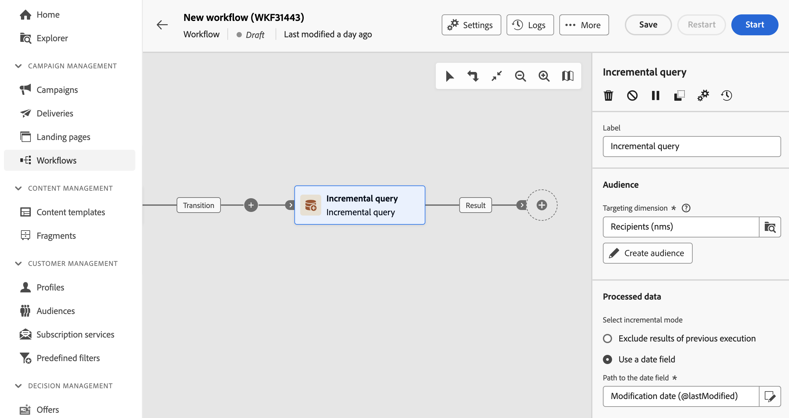

# 增量查詢 {#incremental-query}

>[!CONTEXTUALHELP]
>id="acw_orchestration_incrementalquery"
>title="增量查詢"
>abstract="「**增量查詢**」活動是一個「**目標市場選擇**」活動，可讓您使用查詢建模工具查詢資料庫。每次執行此活動時，都會排除先前執行的結果。這可讓您只鎖定新元素。"

>[!CONTEXTUALHELP]
>id="acw_orchestration_incrementalquery_history"
>title="增量查詢歷史記錄"
>abstract="增量查詢歷史記錄"

>[!CONTEXTUALHELP]
>id="acw_orchestration_incrementalquery_processeddata"
>title="增量查詢處理的資料"
>abstract="增量查詢處理的資料"

**增量查詢**&#x200B;活動是&#x200B;**鎖定目標**&#x200B;活動，可讓您依排程查詢資料庫。 每次執行此活動時，都會排除先前執行的結果。這可讓您僅鎖定新元素。

>[!NOTE]
>
>雖然Campaign使用者端主控台已將&#x200B;**[!UICONTROL 增量查詢]**&#x200B;活動與內建排程器整合，但Campaign Web使用者介面會單獨處理此功能。 若要排程增量查詢執行，請在&#x200B;**[!UICONTROL 增量查詢]**&#x200B;活動之前的工作流程中新增&#x200B;**[!UICONTROL 排程器]**&#x200B;活動。 [瞭解如何設定排程器活動](scheduler.md)

**[!UICONTROL 增量查詢]**&#x200B;活動可用於各種用途：

* 將個人分段以定義訊息、對象或其他操作的目標。
* 匯出資料。 例如，使用活動定期匯出檔案中的新記錄檔。 這對於外部報告或商業智慧工具非常有用。

先前執行已定位的母體會儲存在工作流程中。 從相同範本啟動的兩個工作流程不共用相同記錄。 不過，在相同工作流程中，以相同增量查詢為基礎的兩個工作會使用相同記錄。

如果增量查詢在其執行期間的結果等於0，則工作流程會暫停，直到查詢下一次程式化執行。 下次執行前，不會處理增量查詢之後的轉變和活動。

## 設定增量查詢活動 {#incremental-query-configuration}

請依照下列步驟設定&#x200B;**增量查詢**&#x200B;活動：

[說明：熒幕擷圖顯示Adobe Campaign中增量查詢活動的設定介面。]\

1. 將&#x200B;**增量查詢**&#x200B;活動新增至您的工作流程。

1. 在&#x200B;**[!UICONTROL 對象]**&#x200B;區段中，選擇&#x200B;**目標維度**，然後按一下&#x200B;**[!UICONTROL 繼續]**。

   目標維度會定義作業的目標母體，例如收件者、合約受益者、操作者或訂閱者。 預設情況下，會從收件者中選取目標。[進一步瞭解目標維度](../../audience/about-recipients.md#targeting-dimensions)

1. 使用查詢建模器來定義您的查詢，類似於在設計新電子郵件時建立受眾的方式。 [瞭解如何使用查詢模型工具](../../query/query-modeler-overview.md)

1. 在&#x200B;**[!UICONTROL 已處理的資料]**&#x200B;區段中，選取要使用的增量模式：

   * **[!UICONTROL 排除先前執行的結果]**：每次執行活動時，都會排除先前執行的結果。

     以前執行中已定位的記錄可記錄從定位之日起的最大天數。 使用&#x200B;**[!UICONTROL History in days]**&#x200B;欄位設定此值。 如果此值為零，收件者永遠不會從記錄中清除。

   * **[!UICONTROL 使用日期欄位]**：此選項會根據特定日期欄位排除先前執行的結果。 從可用於所選目標維度的屬性清單中選擇所需的日期欄位。 後續執行工作流程時，只會擷取在上次執行日期之後修改或建立的資料。

     在第一次執行工作流程後，**[!UICONTROL 上次執行日期]**&#x200B;欄位將變為可用。 這會指定下次執行時使用的日期，並在每次執行工作流程時自動更新。 您可以手動覆寫此值以符合您的需求。

   >[!NOTE]
   >
   >根據所選的日期欄位，**[!UICONTROL 使用日期欄位]**&#x200B;模式可提供更多彈性。 例如，如果指定的欄位與修改日期相對應，則日期欄位模式會擷取最近更新的資料。 另一種模式會排除先前執行中已鎖定的錄製，即使這些錄製自上次執行工作流程後已修改。

## 範例 {#incremental-query-example}

以下範例顯示每週篩選Adobe Campaign資料庫中設定檔的工作流程設定。 它會鎖定訂閱瑜伽電子報服務的個人，並向他們傳送歡迎電子郵件。

工作流程包含下列元素：

* **[!UICONTROL 排程器]**&#x200B;活動，每週一早上6:00執行工作流程。
* **[!UICONTROL 增量查詢]**&#x200B;活動，在第一次執行期間鎖定所有目前訂閱者，在後續執行期間只鎖定新訂閱者。
* **[!UICONTROL 電子郵件傳遞]**&#x200B;活動。