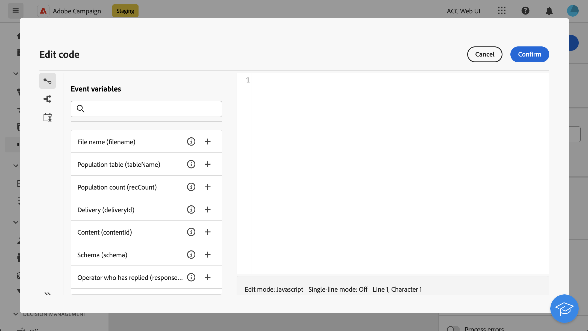

# JavaScript 程式碼 {#javascript-code}

>[!CONTEXTUALHELP]
>id="acw_orchestration_javascript"
>title="JavaScript 程式碼"
>abstract="此 **javascript程式碼** 活動可讓您在工作流程的內容中執行JavaScript指令碼。 這可讓您執行動作或從資料庫收集資訊。 使用 **簡單** JavaScript程式碼活動，可在工作流程執行時執行一個程式碼片段。 **進階** Javascript程式碼活動可讓您透過依序執行兩個不同的程式碼片段，來執行更複雜的作業。 第一次啟動工作流程時，會執行第一個呼叫。 每次工作流程再次執行時，就會執行第二次呼叫中定義的程式碼。"

>[!CONTEXTUALHELP]
>id="acw_orchestration_javascript_snippet"
>title="JavaScript程式碼片段"
>abstract="定義執行活動時要執行的指令碼。 如果您正在設定 **進階** JavaScript活動時，您需要編輯兩個程式碼片段：第一個是在工作流程第一次執行時執行的呼叫程式碼，下一個是在工作流程下一次呼叫時執行的呼叫程式碼。"

>[!CONTEXTUALHELP]
>id="acw_orchestration_javascript_execution"
>title="JavaScript 執行"
>abstract="設定執行延遲，以在執行一段時間後停止活動。 依預設，執行階段不能超過 1 小時。在這類延遲之後，此流程將中止並顯示錯誤訊息，並且活動執行會失敗。若要忽略此限制，請將值設為 0。"

>[!CONTEXTUALHELP]
>id="acw_orchestration_javascript_transition"
>title="JavaScript轉換"
>abstract="如果要新增多個輸出轉變，請按一下 **[!UICONTROL 新增轉變]** 按鈕。 舉例來說，這可讓您根據JavaScript程式碼活動中定義的特定條件，觸發特定轉變。 此選項適用於 **進階** 僅限JavaScript程式碼活動。"

此 **javascript程式碼** 活動是 **資料管理** 活動。 使用此活動可在工作流程內容中執行JavaScript指令碼。 這可讓您從資料庫收集資訊，或執行其他複雜的作業。

## 設定JavaScript程式碼活動 {#javascript-code-configuration}

請依照下列步驟設定 **javascript程式碼** 活動：

1. 新增 **javascript程式碼** 活動放入工作流程。

1. 選擇要建立的活動型別：

   * **簡單**：執行一個程式碼片段。
   * **進階**：此選項可讓您執行兩個不同的程式碼片段，以執行更進階的作業。 [瞭解如何設定進階JavaScript活動](#advanced)

   >[!NOTE]
   >
   >透過Campaign Web使用者介面，我們已將兩個活動合併為一個 **簡單** 和 **進階** JavaScript程式碼功能。 此合併不會以任何方式影響活動的功能。

1. 確認，然後按一下 **[!UICONTROL 編輯程式碼]** 按鈕以開啟運算式編輯器。 左側窗格會提供預先定義的語法，讓您用來建置程式碼，包括事件變數。 [瞭解如何使用事件變數和運算式編輯器](../event-variables.md)

   

1. 在 **[!UICONTROL 執行]** 區段，將延遲設定為執行期間後停止活動。 依預設，執行階段不能超過 1 小時。在這類延遲之後，此流程將中止並顯示錯誤訊息，並且活動執行會失敗。若要忽略此限制，請將值設為 0。

   

1. 切換至 **[!UICONTROL 處理錯誤]** 選項可保留指令碼執行期間發生的其他輸出轉換錯誤。

## 進階JavaScript程式碼活動 {#advanced}

進階JavaScript活動可讓您執行複雜的操作。 它可讓您：

* 執行兩個不同的程式碼片段。 第一個程式碼片段會在第一次啟動工作流程時執行。 每次工作流程再次執行時，都會執行第二個呼叫中定義的程式碼片段。
* 新增多個輸出轉變，您可使用指令碼動態互動。

若要設定進階JavaScript程式碼活動，請執行下列步驟：

1. 選取 **進階** 輸入，然後設定要執行的程式碼片段：

   * 按一下 **[!UICONTROL 編輯首次通話代碼]** 定義要在第一次呼叫期間執行的指令碼。
   * 按一下 **[!UICONTROL 編輯下一個通話代碼]** 定義下次呼叫工作流程時要執行的指令碼。 （選擇性）

1. 若要新增一或多個輸出轉變，請按一下 **[!UICONTROL 新增轉變]** 按鈕並為每個轉變指定標籤和內部名稱。

   在此範例中，我們已設定由程式碼片段中的指令碼根據特定條件啟動的兩個轉變。

   

1. 完成活動的設定並啟動工作流程。

## 範例 {#javascript-code-example}

### 根據傳入母體初始化變數 {#example1}

此範例說明如何根據工作流程所定位的設定檔數初始化變數。


在此，我們正在從資料庫中鎖定VIP設定檔。 我們要建立名為「channel」的變數，其值取決於「建立對象」活動鎖定的設定檔數量：

* 如果目標設定檔超過1000個，請使用「電子郵件」值初始化變數。
* 否則，請使用值「sms」將其初始化。

要執行此操作，請依照下列步驟執行：

1. 新增 **javascript程式碼** 具有型別的活動 **簡單** 在 **建立對象** 活動。

1. 按一下 **編輯程式碼** 並設定程式碼片段，如下所示：

   ```
   if (vars.recCount > 1000)
       vars.channel ="email"
   else
       vars.channel = "sms"
   ```

1. 啟動工作流程。 「頻道」變數是以「電子郵件」或「簡訊」值建立，視設定的目標設定檔數量而定。 **建立對象** 活動。

### 根據變數的值觸發轉變 {#example2}

此範例說明如何根據變數的值觸發轉變。


在此，工作流程從 **外部訊號** 活動，變數(`interest`)傳遞。 變數的值為「執行中」或「瑜伽」，視初始工作流程中執行的篩選作業而定。

我們想要根據變數的值，在工作流程中觸發不同的轉變。

要執行此操作，請依照下列步驟執行：

1. 新增 **javascript程式碼** 具有型別的外部訊號活動後的活動 **進階**.

1. 新增兩個轉變：每個可能的變數值（「執行中」、「瑜伽」）各一個。

1. 按一下 **編輯首次通話代碼** 並設定程式碼片段，如下所示：

   ```
   if (vars.interest=="running")
       task.postEvent(task.transitionByName("running"));
   else
       task.postEvent(task.transitionByName("yoga"));
   ```

1. 完成每個轉變的設定以符合您的需求，然後開始工作流程。 兩個輸出轉變中的一個是啟動的，根據 `interest` 已傳遞的變數 **外部訊號** 活動。
