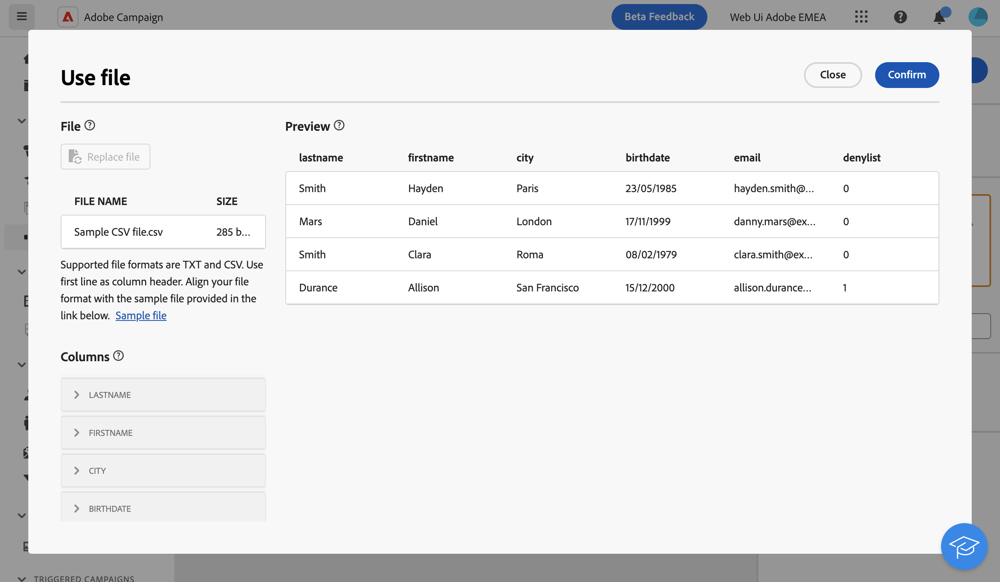

# 載入檔案 {#load-file}

>[!CONTEXTUALHELP]
>id="acw_orchestration_loadfile"
>title="載入檔案活動"
>abstract="**載入檔案**&#x200B;活動為&#x200B;**資料管理**&#x200B;活動。使用此活動可以處理儲存在外部檔案中的資料。"

>[!CONTEXTUALHELP]
>id="acw_orchestration_loadfile_samplefile"
>title="範例檔案"
>abstract="範例檔案"

>[!CONTEXTUALHELP]
>id="acw_orchestration_loadfile_nameofthefile"
>title="檔案名稱"
>abstract="檔案名稱"

>[!CONTEXTUALHELP]
>id="acw_orchestration_loadfile_targetdb"
>title="Target 資料庫"
>abstract="Target 資料庫"

>[!CONTEXTUALHELP]
>id="acw_orchestration_loadfile_rejectmgt"
>title="拒絕載入檔案活動的管理"
>abstract="拒絕載入檔案活動的管理"

>[!CONTEXTUALHELP]
>id="acw_orchestration_loadfile_outboundtransition"
>title="拒絕管理傳出轉變"
>abstract="拒絕管理傳出轉變"

>[!CONTEXTUALHELP]
>id="acw_orchestration_loadfile_outboundtransition_reject"
>title="拒絕管理拒絕的傳出轉變"
>abstract="拒絕管理拒絕的傳出轉變"

>[!CONTEXTUALHELP]
>id="acw_orchestration_loadfile_formatting"
>title="載入檔案活動的格式化"
>abstract="載入檔案活動的格式化"

>[!CONTEXTUALHELP]
>id="acw_orchestration_loadfile_targetfile"
>title="載入檔案活動的目標檔案"
>abstract="載入檔案活動的目標檔案"

>[!CONTEXTUALHELP]
>id="acw_orchestration_loadfile_valueremapping"
>title="載入檔案活動的值重新對應"
>abstract="載入檔案活動的值重新對應"

>[!CONTEXTUALHELP]
>id="acw_orchestration_loadfile_command"
>title="載入檔案命令"
>abstract="允許任意命令進行預處理是一個安全性問題，停用安全選項 XtkSecurity_Disable_Preproc 以強制使用預先定義的命令清單。"

>[!CONTEXTUALHELP]
>id="acw_orchestration_loadfile_delete"
>title="匯入後刪除檔案"
>abstract="切換「**匯入後刪除檔案**」在匯入檔案後，從伺服器刪除原始檔案。"

**載入檔案**&#x200B;活動為&#x200B;**資料管理**&#x200B;活動。使用此活動來處理儲存在外部檔案中的設定檔和資料。 設定檔和資料不會新增至資料庫，但輸入檔案中的所有欄位都可用於 [個人化](../../personalization/gs-personalization.md)，或更新設定檔或任何其他表格。

>[!NOTE]
>支援的檔案格式為：文字(TXT)和逗號分隔值(CSV)。

此活動可搭配 [調解](reconciliation.md) 活動，將未識別的資料連結至現有資源。 例如， **載入檔案** 活動可放置在 **調解** 活動（如果將非標準資料匯入資料庫）。

## 設定載入檔案活動 {#load-configuration}

請依照下列步驟設定 **載入檔案** 活動：

1. 新增 **載入檔案** 活動放入工作流程。 按一下 **從檔案選取** 按鈕。

1. 選取要使用的本機檔案。 格式必須與此對齊 [範例檔案](../../audience/file-audience.md#sample-file).

1. 在畫面中央區段預覽並檢查資料的對應方式。

   

1. 使用 **欄** 區段來調整每欄的資料型別和寬度。

1. 在 **格式化** 區段位於欄設定下，指定外部檔案的格式化，以確保資料正確匯入。

1. 當設定正確時，按一下「**確認**」。

## 範例{#load-example}

外部檔案載入的範例，用於 **調解** 活動可在 [本節](reconciliation.md#reconciliation-example).
