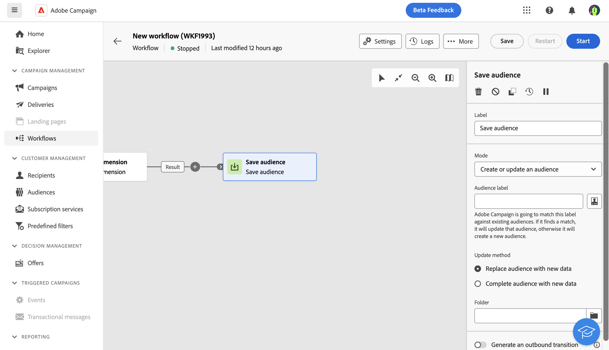

# 儲存對象 {#save-audience}

>[!CONTEXTUALHELP]
>id="acw_orchestration_save_audience"
>title="儲存對象"
>abstract="使用此活動來更新現有的對象，或是從工作流程中的母體運算上游建立新的對象。建立的對象將新增至對象清單中，並可透過「**對象**」選單使用。"

此 **儲存對象** 活動是 **目標定位** 活動。 此活動可讓您更新現有的對象，或是從工作流程中的母體運算上游建立新的對象。 建立的對象會新增至應用程式對象清單，並可透過 **受眾** 功能表。

此活動主要用於將母體族群轉換為可重複使用的對象，讓母體族群可繼續在相同工作流程中運算。 將其連線到其他目標定位活動，例如 **建立對象** 或 **合併** 活動。

## 設定「儲存對象」活動{#save-audience-configuration}

請依照下列步驟設定 **儲存對象** 活動：

1. 新增 **儲存對象** 活動至您的工作流程。

1. 在 **模式** 在下拉式清單中，選取您要執行的動作：

   * **建立或更新現有對象**：定義 **對象標籤**. 如果對象已存在，則會更新，否則將建立新對象。

   * **更新現有的對象**：選擇 **對象** 您要在現有對象清單中進行更新。

1. 選取 **更新模式** 將套用至現有受眾：

   * **以新資料取代受眾內容**：所有對象內容都會被取代。 遺失舊資料。僅保留儲存對象活動之入站轉變的資料。此選項會清除更新對象的對象型別和目標定位維度。

   * **使用新資料完成對象**：保留舊的對象內容，並新增儲存對象活動入站轉變的資料。

1. 檢查 **產生出站轉變** 選項(如果您想要在 **儲存對象** 活動。

之後著，儲存的對象內容便可在對象的詳細資料檢視中使用，您可從以下位置存取： **受眾** 功能表。 此檢視中可用的欄對應於工作流程之入站轉變的欄 **儲存對象** 活動。

## 範例{#save-audience-example}

以下範例說明如何從目標定位進行簡單的對象更新。 會新增排程器，以每月執行工作流程一次。 查詢會復原訂閱了不同可用應用程式服務的所有設定檔。 此 **儲存對象** 活動會刪除自上次工作流程執行以來從服務取消訂閱的設定檔，並新增新訂閱的設定檔，以更新對象。
