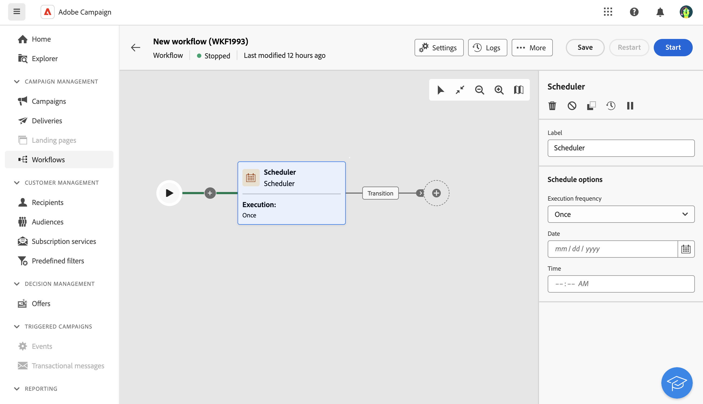
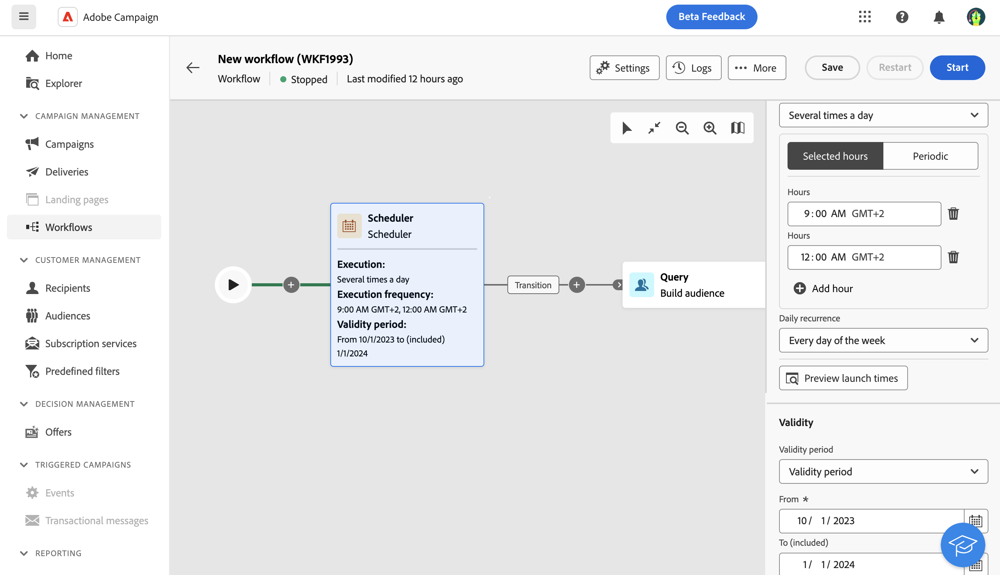

# 排程器 {#scheduler}

>[!CONTEXTUALHELP]
>id="acw_orchestration_scheduler"
>title="排程器活動"
>abstract="「**排程器**」活動可讓您安排工作流程何時開始。此活動應視為已排程的開始。其只能當作工作流程的第一個活動。"

**排程器**&#x200B;活動是&#x200B;**流程控制**&#x200B;活動。 它可讓您排程工作流程何時開始。 此活動應視為已排程的開始。其只能當作工作流程的第一個活動。

## 最佳實務 {#scheduler-best-practices}

* 請勿將工作流程排程為超過每15分鐘執行一次，因為這樣可能會阻礙整體系統效能並在資料庫中建立區塊。
* 若要在工作流程中傳送單次傳遞，請新增排程器活動，並將其設定為執行&#x200B;**一次**。 定義傳遞設定中的&#x200B;**排程**。
* 若要在工作流程中傳送循環傳遞，請使用&#x200B;**排程器**&#x200B;活動並設定執行頻率。 循環傳遞活動不允許您定義排程。

## 設定排程器活動 {#scheduler-configuration}

>[!CONTEXTUALHELP]
>id="acw_orchestration_schedule_validity"
>title="排程器有效性"
>abstract="您可以定義排程器的有效期限。它可以是永久的 (預設)，也可以在特定日期之前有效。"

>[!CONTEXTUALHELP]
>id="acw_orchestration_schedule_options"
>title="排程器選項"
>abstract="定義排程器的頻率。它可以在特定時刻執行，可每天、每週或每月執行一次或多次。"

請依照下列步驟設定&#x200B;**排程器**&#x200B;活動：

1. 將&#x200B;**排程器**&#x200B;活動新增至工作流程。

1. 設定&#x200B;**執行頻率**：

   * **一次**：工作流程只執行一次。
   * **每日**：工作流程會在特定時間執行，一天一次。
   * **一天數次**：工作流程會定期執行數次。 設定在特定時間或定期執行。
   * **每週**：工作流程會在指定的時間執行，每週執行一或數次。
   * **每月**：工作流程會在指定的時間執行，每月執行一或數次。 選取需要執行工作流程的月份。 您也可以在月份的指定工作日（例如當月的第二個星期二）設定執行。

1. 根據所選頻率定義執行詳細資訊。詳細欄位可能會依使用的頻率（時間、重複頻率、指定天數及類似選項）而有所不同。

1. 按一下&#x200B;**預覽啟動時間**&#x200B;以檢查工作流程接下來十個執行的排程。

1. 定義排程器的有效期間：

   * **永久（永不過期）**：工作流程會根據指定的頻率執行，對時間範圍或反複次數沒有任何限制。
   * **有效期間**：工作流程會根據指定的頻率執行，直到特定日期為止。 指定開始和結束日期。

>[!NOTE]
>若要立即啟動工作流程，請按一下排程器頂端動作列中的&#x200B;**執行擱置中的工作**。 此按鈕僅在工作流程啟動後才能使用。

## 範例 {#scheduler-example}

在下列範例中，活動已設定為工作流程在2023年10月1日至2024年1月1日的一週中每日早上9點和12點執行數次。

