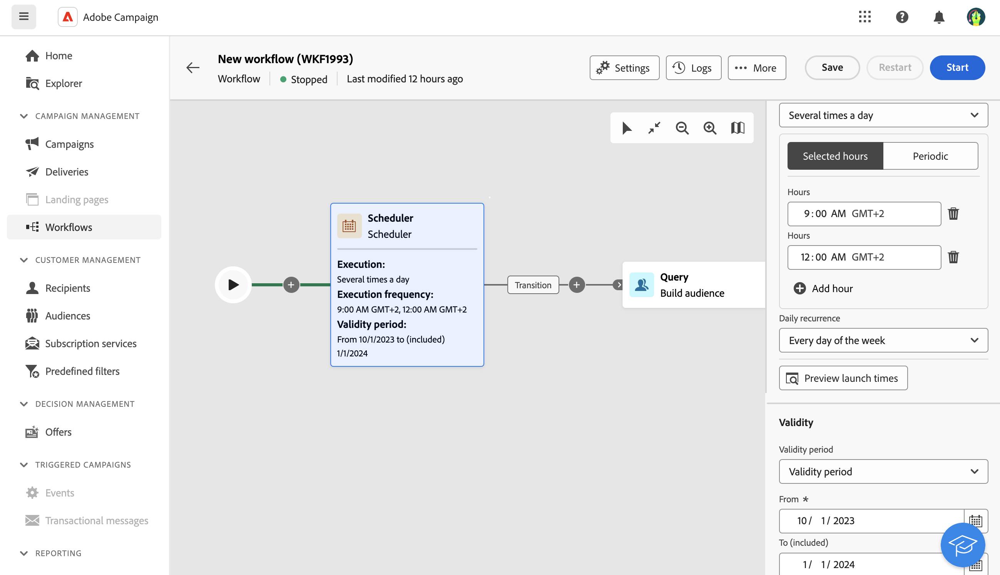

# 排程器 {#scheduler}

>[!CONTEXTUALHELP]
>id="acw_orchestration_schedule_options"
>title="排程器活動"
>abstract="排程器活動可讓您……"

此 **排程器** 活動是 **流量控制** 活動。 它可讓您排程工作流程何時開始。 此活動應視為已排程的開始。 它只能用作工作流程的第一個活動。

## 最佳實務

請勿將工作流程排程為每15分鐘執行一次，因為這樣可能會阻礙整體系統效能並在資料庫中建立區塊。

## 設定

請依照下列步驟設定 **排程器** 活動：

1. 新增 **排程器** 活動至您的工作流程。

   <!---->

1. 設定 **執行頻率**：

   * **一次**：工作流程只需執行一次。

   * **每日**：工作流程會在指定的時間執行，一天一次。

   * **一天幾次：** 工作流程會定期執行數次。 您可以設定在特定時間或定期執行。

   * **每週**：工作流程會在指定的時間執行，每週執行一或數次。

   * **每月**：工作流程會在指定的時間執行，每月執行一或數次。 當您需要執行工作流程時，可以選取月份。您也可以在月份的指定週日（例如，當月的第二個星期二）設定執行。

1. 根據所選頻率定義執行詳細資訊。詳細欄位可能會依使用的頻率（時間、重複頻率、指定天數等）而有所不同。

1. 按一下 **預覽啟動時間** 檢查工作流程接下來十個執行的排程。

1. 定義排程器的有效期間：

   * **永久（永不過期）**：工作流程會根據指定的頻率執行，對時間範圍或迭代次數沒有任何限制。

   * **有效期**：工作流程會根據指定的頻率執行，直到特定日期為止。 您必須指定開始和結束日期。

## 範例

在下列範例中，活動已設定為每天早上9點和12點（從2023年10月1日到2024年1月1日）開始工作流程數次。

<!---->

