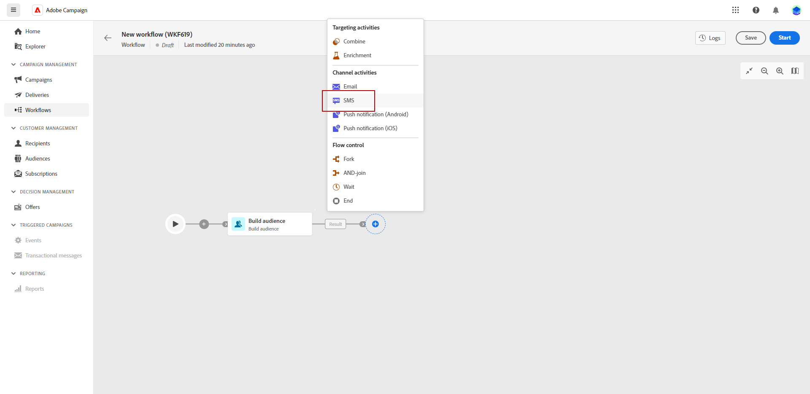

# SMS {#sms}

此 **簡訊** 活動提供在工作流程中傳送SMS訊息的功能。 它可讓您將SMS傳送至在相同工作流程中決定的特定目標的自動化。

若要定義SMS的收件者，您可以使用建立受眾活動，在工作流程中的SMS傳送活動之前設定收件者。 了解更多。

1. 建立和設定新工作流程後，請新增「建立對象」活動以選取現有對象，或使用規則產生器定義您自己的查詢。

1. 將SMS頻道活動新增至您的工作流程。

   
<!--
1. Select the Type of delivery:

    * Single delivery: Choose this option if you want the SMS to be sent only once. You have the flexibility to choose whether or not to include an outbound transition from this activity.

    * Recurring delivery: Choose this option if you want the SMS to be sent multiple times based on a defined frequency. The frequency can be configured using a Scheduler activity, allowing you to schedule the SMS to be sent at regular intervals.
-->

1. 選取您的活動。 從傳遞功能表中，選取您要用於此傳遞的範本。 了解範本的詳細資訊

1. 按一下「建立傳送」以設定您的SMS傳送。 如需簡訊傳送的詳細資訊，請參閱本頁面。

1. 傳送準備就緒後，請導覽回工作流程，然後按一下「開始」以啟動工作流程。

1. 依預設，啟動傳遞工作流程會觸發訊息準備階段，而不會立即傳送訊息。

   從SMS活動的進階功能表按一下檢閱和傳送，以確認傳送。

1. 在您的SMS傳送控制面板中，按一下傳送。
