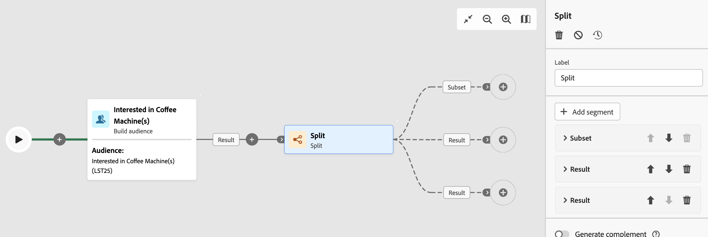
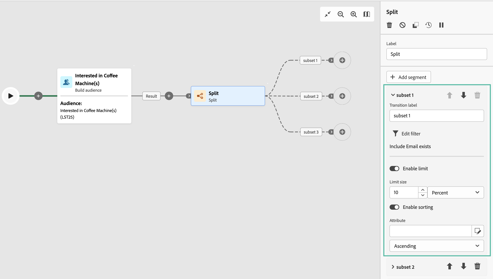
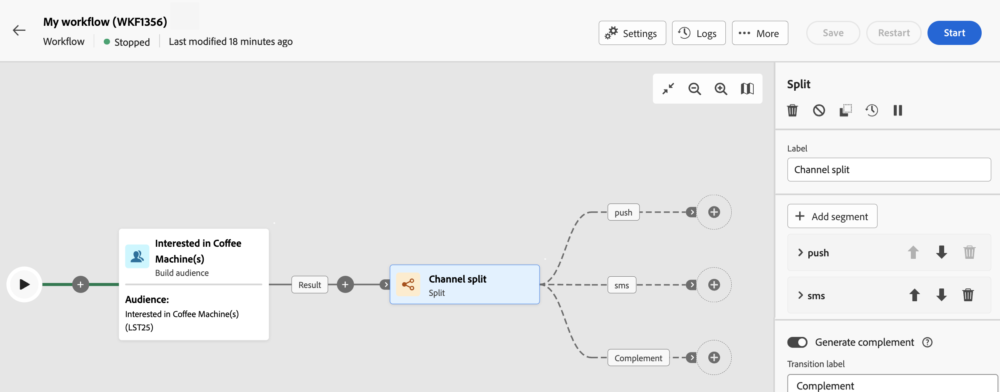

# 分割 {#split}

>[!CONTEXTUALHELP]
>id="acw_orchestration_split"
>title="分割活動"
>abstract="**分割**&#x200B;活動可讓您根據不同選擇標準 (例如篩選規則或族群大小) 將傳入族群分割到多個子集。"

**分割**&#x200B;活動是一種&#x200B;**目標定位**&#x200B;活動，可讓您根據不同選擇標準 (例如篩選規則或母體大小) 將傳入母體分割到多個子集。

## 設定分割活動 {#split-configuration}

>[!CONTEXTUALHELP]
>id="acw_orchestration_split_segments"
>title="分割活動的區段"
>abstract="依需求新增任意數量的子集，將傳入的族群進行細分。  執行&#x200B;**分割** 活動時，系統會依照子集新增至活動的順序，將族群細分成不同的子集。在開始工作流程之前，請確保已使用箭頭按鈕按照符合您需求的順序排列子集。"

>[!CONTEXTUALHELP]
>id="acw_orchestration_split_filter"
>title="分割活動篩選器"
>abstract="若要將篩選條件套用到子集，請按一下「**[!UICONTROL 建立篩選器]**」並使用查詢建模工具設定所需的篩選規則。例如，將電子郵件地址存在於資料庫之傳入母體的設定檔包含在內。"
>additional-url="https://experienceleague.adobe.com/en/docs/zh-hant/campaign-web/v8/query-database/query-modeler-overview" text="使用查詢建模工具"

>[!CONTEXTUALHELP]
>id="acw_orchestration_split_limit"
>title="分割活動限制"
>abstract="若要限制子集所選設定檔的數量，請開啟「**[!UICONTROL 啟用限制]**」選項，並指定要包含的母體數量或百分比。"

>[!CONTEXTUALHELP]
>id="acw_orchestration_split_sorting"
>title="分割活動排序"
>abstract="為子集設定母體限制時，您可以根據特定設定檔屬性按升序或降序順序來排列所選設定檔。為此，請開啟「**啟用排序**」選項。例如，您可以限制子集僅包含購買金額最高的前 50 個設定檔。"

>[!CONTEXTUALHELP]
>id="acw_orchestration_split_complement"
>title="分割產生補充集"
>abstract="設定完所有子集後，您可以選擇與任何子集都不相符的剩餘母體，並將其包含在額外的輸出轉變中。為此，請開啟「**產生補充集**」選項。"

>[!CONTEXTUALHELP]
>id="acw_orchestration_split_generatesubsets"
>title="在相同表格中產生所有子集"
>abstract="切換此選項可將所有子集歸類至單一的輸出轉換。"

>[!CONTEXTUALHELP]
>id="acw_orchestration_split_emptytransition"
>title="省略空值轉變"
>abstract="省略空值轉變。"

>[!CONTEXTUALHELP]
>id="acw_orchestration_split_enable_overlapping"
>title="啟用輸出母體的重疊"
>abstract="啟用輸出母體的重疊"

請按照以下步驟設定&#x200B;**分割**&#x200B;活動：

1. 在您的工作流程中新增一個&#x200B;**分割**&#x200B;活動。

1. 活動設定面板隨即開啟，其中包含預設子集。按一下「**新增區段**」按鈕，新增所需數量的子集，依此來分割傳入母體。

   

   >[!IMPORTANT]
   >
   >當 **Split** 活動執行時，母體會依其新增至活動的順序，跨不同的子集進行分段。 例如，如果第一個子集取得初始母體的 70%，則下一個新增的子集只能將其選擇標準套用到剩餘的 30%，依此類推。
   >
   >開始工作流程之前，請確定您已依需求排序子集。 要執行此操作，請使用箭頭按鈕來變更子集的位置。

1. 新增子集後，活動將顯示與子集一樣多的輸出轉變。我們強烈建議變更每個子集的標籤，以便在工作流程畫布中輕鬆識別它們。

1. 設定每個子集應如何篩選傳入母體。要執行此操作，請依照下列步驟執行：

   1. 開啟子集以顯示其屬性。

   1. 若要將篩選條件套用到子集，請按一下「**[!UICONTROL 建立篩選器]**」並使用查詢建模工具設定所需的篩選規則。例如，將傳入母體的設定檔包含在資料庫中存在其電子郵件地址。 [瞭解如何使用查詢建模器](../../query/query-modeler-overview.md)

   1. 若要限制子集所選設定檔的數量，請開啟「**[!UICONTROL 啟用限制]**」選項，並指定要包含的母體數量或百分比。

      

      >[!NOTE]
      >
      >為子集設定母體限制時，您可以根據特定設定檔屬性按升序或降序順序來排列所選設定檔。為此，請開啟「**[!UICONTROL 啟用排序]**」選項。例如，您可以限制子集僅包含購買金額最高的前 50 個設定檔。

1. 設定完所有子集後，您可以選擇與任何子集都不相符的剩餘母體，並將其包含在額外的輸出轉變中。為此，請開啟「**[!UICONTROL 產生補充集]**」選項。

   

   >[!NOTE]
   >
   >此 **[!UICONTROL 在相同表格中產生所有子集]** 選項可讓您將所有子集群組為單一輸出轉變。

該活動現已完成設定。在工作流程執行時，系統會依照子集新增至活動的順序，將母體分割到不同的子集。

## 範例{#split-example}

在以下範例下，我們將利用&#x200B;**[!UICONTROL 分割]**&#x200B;活動根據要使用的通訊管道將對象分割到不同的子集：

* **子集 1「推播」**：此子集包含已安裝我們行動應用程式的所有設定檔。
* **子集 2「簡訊」**：行動電話使用者：對於未歸入子集 1 的剩餘母體，子集 2 會套用篩選規則來選取其行動電話存在於資料庫的設定檔。
* **產生補充集**：此轉變擷取與子集 1 或子集 2 不相符的所有剩餘設定檔。具體來說，它包含沒有安裝行動應用程式也沒有行動電話的設定檔，例如沒有安裝行動應用程式或沒有已註冊行動電話號碼的使用者。

