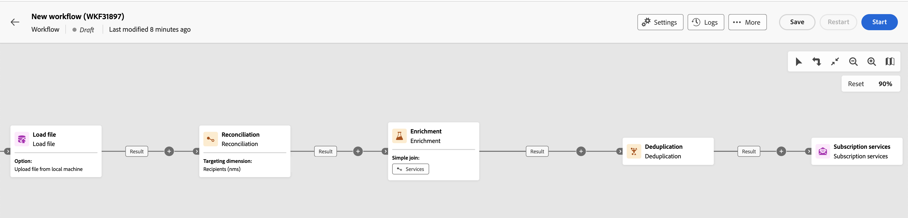
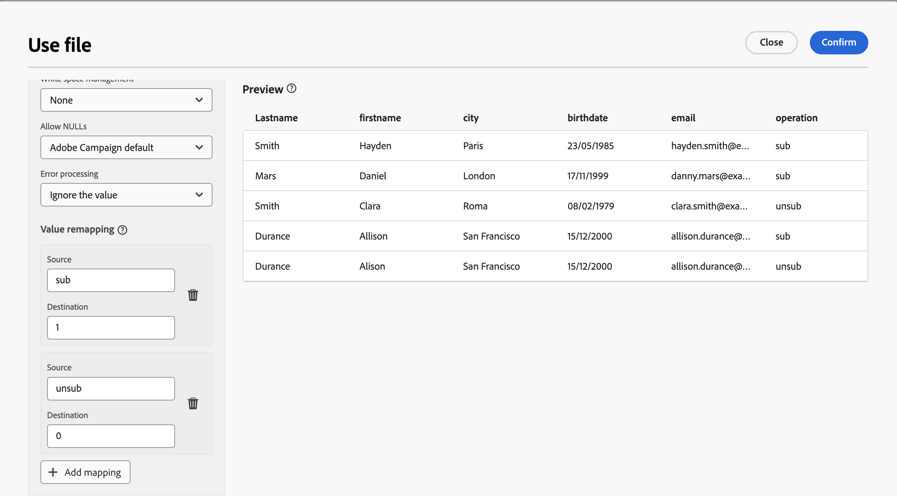
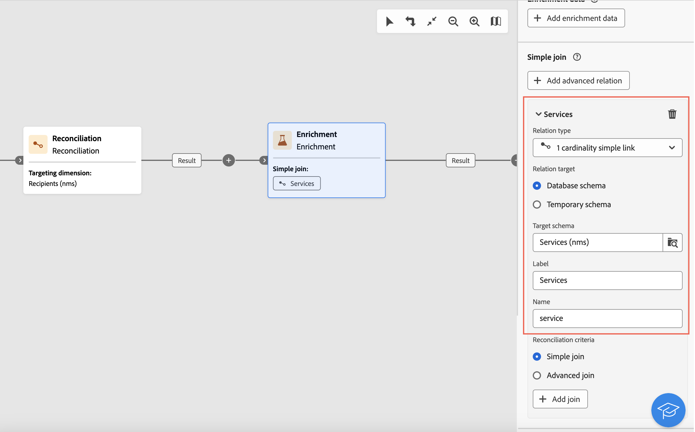

# 訂閱服務 {#subscriptipon-services}


>[!CONTEXTUALHELP]
>id="acw_homepage_welcome_rn2"
>title="訂閱服務活動"
>abstract="使用新的訂閱服務工作流程活動來管理服務的訂閱。 您可以訂閱或取消訂閱母體，也可以從外部檔案更新多個訂閱。 您也可以選擇傳送確認訊息以通知訂閱者。"
>additional-url="https://experienceleague.adobe.com/docs/campaign-web/v8/release-notes/release-notes.html?lang=zh-Hant" text="請參閱版本注意事項"


>[!CONTEXTUALHELP]
>id="acw_orchestration_subscription"
>title="訂閱服務活動"
>abstract="「訂閱服務」活動允許多個設定檔在單一動作中訂閱或取消訂閱服務。"

>[!CONTEXTUALHELP]
>id="acw_orchestration_subscription_general"
>title="訂閱服務一般引數"
>abstract="選擇所需的服務，並選擇要執行的動作（訂閱或取消訂閱）。 切換至 **傳送確認訊息** 開啟選項，通知母體已訂閱或已取消訂閱所選服務。"

>[!CONTEXTUALHELP]
>id="acw_orchestration_subscription_outboundtransition"
>title="產生傳出轉變"
>abstract="切換「**產生傳出轉變**」選項，可在活動之後新增轉變。"

此 **訂閱服務** 活動是 **資料管理** 活動。 它可讓您為轉變中指定的母體建立或刪除資訊服務的訂閱。

## 設定訂閱服務活動 {#subscription-services-configuration}

請依照下列步驟設定 **訂閱服務** 活動：

1. 新增 **訂閱服務** 活動放入工作流程。 在鎖定設定檔目標或匯入包含已識別資料的檔案後，您可以使用此活動。

1. 使用以下其中一個選項，選取您要管理訂閱的服務：

   * **[!UICONTROL 選取特定服務]**：手動選取服務，使用 **[!UICONTROL 服務]** 欄位。

   * **[!UICONTROL 從入站轉變]**：使用入站轉變中指定的服務。 例如，您可以匯入指定每行所管理之服務的檔案。接著會為每個設定檔動態選取要對其執行操作的服務。

   

1. 選取要執行的作業： **訂閱** 或 **取消訂閱**.

   如果服務是在入站轉變中定義，您可以選擇如何擷取此作業：

   * **選取特定作業型別**：手動選取要執行的操作(**訂閱** 或 **取消訂閱**)

   * **從入站轉變的路徑中選取操作型別**：選取輸入資料的欄，並指定為每個記錄執行的操作。 例如，您可以匯入一個檔案，該檔案指定對「operation」欄中的每一行執行的操作。

     >[!NOTE]
     >
     >此處只能選取布林值或整數欄位。 請確定包含要執行之作業的資料符合此格式。 例如，如果您是從「載入檔案」活動載入資料，請檢查您是否已正確設定包含此作業之欄的格式 **[!UICONTROL 載入檔案]** 活動。 範例顯示於 [本節](#uc2).

   

1. 若要通知收件者他們已訂閱或取消訂閱所選服務，請切換 **[!UICONTROL 傳送確認訊息]** 選項開啟。 此通知的內容是在與資訊服務相關的傳遞範本中定義的。

1. 如果您使用來自入站轉變的資料，會 **[!UICONTROL 其他資訊]** 區段隨即顯示，您可在此指定每個記錄的資料與訂閱來源。 您可以將此區段保留空白，這樣在執行工作流程時就不會設定日期或來源。

   * 如果傳入資料包含一欄，指出服務設定檔的訂閱日期，則可在 **[!UICONTROL 日期]** 欄位。

   * 在 **[!UICONTROL 來源路徑]** 欄位，定義訂閱的來源。 您可以核取「 」，將其設為輸入資料的其中一個欄位，或設為您選取的常數值 **[!UICONTROL 將常數設定為原點]** 選項。

   

1. 若要在活動後新增出站轉變，請切換 **[!UICONTROL 產生出站轉變]** 選項開啟。

## 範例 {#example}

### 將對象訂閱至特定服務 {#uc1}

以下工作流程說明如何將受眾訂閱現有服務。


* A **[!UICONTROL 建立對象]** 活動會鎖定現有對象。

* A **[!UICONTROL 訂閱服務]** 活動可讓您選取必須訂閱設定檔的服務。

### 從檔案更新多個訂閱狀態 {#uc2}

以下工作流程說明如何匯入包含設定檔的檔案，並將其訂閱更新為檔案中指定的數個服務。



* A **[!UICONTROL 載入檔案]** 活動會載入包含資料的CSV檔案，並定義匯入欄的結構。 「服務」和「作業」欄指定要更新的服務及要執行的作業（訂閱或取消訂閱）。

  ```
  Lastname,firstname,city,birthdate,email,service,operation
  Smith,Hayden,Paris,23/05/1985,hayden.smith@example.com,yoga,sub
  Mars,Daniel,London,17/11/1999,danny.mars@example.com,running,sub
  Smith,Clara,Roma,08/02/1979,clara.smith@example.com,running,unsub
  Durance,Allison,San Francisco,15/12/2000,allison.durance@example.com,yoga,sub
  Durance,Alison,San Francisco,15/12/2000,allison.durance@example.com,running,unsub
  ```

  如您所注意的，此操作在檔案中指定為 &quot;sub&quot; 或 &quot;unsub&quot;。此系統需要一個 **Boolean** 或 **Integer** 整數值來識別要執行的操作：&quot;0&quot; 為取消訂閱與 &quot;1&quot; 為訂閱。為符合此要求，必須在範例檔案設定畫面的「operation」欄的詳細資訊中執行值的重新對應。

  

  如果您的檔案已使用 &quot;0&quot; 及 &quot;1&quot; 來識別此操作，則不需要重新映射這些值。僅確定欄已處理為 **布林值** 或 **整數** 在範例檔案欄中。

* A **[!UICONTROL 調解]** 活動會將檔案中的資料識別為屬於Adobe Campaign資料庫的設定檔維度。 此 **電子郵件** 檔案的欄位與 **電子郵件** 設定檔資源的欄位。

  

* 一個 **[!UICONTROL 擴充]** 活動會建立指向「服務(nms)」表格的連結，並在上傳檔案的「服務」欄與資料庫中的「服務」內部名稱欄位之間建立簡單聯結。

  

* A **[!UICONTROL 重複資料刪除]** 根據 **電子郵件** 識別重複專案的欄位。 消除重複項目非常重要，因為所有資料的服務訂閱將會在出現重複項目時失敗。

  

* A **[!UICONTROL 訂閱服務]** 會將要更新的服務識別為來自此轉變，透過中建立的連結進行 **[!UICONTROL 調解]** 活動。

  此 **[!UICONTROL 作業型別]** 識別為來自 **操作** 檔案的欄位。 此處只能選取 Boolean 或 Integer 欄位。如果檔案中包含要執行的操作欄未出現在清單中，請確保您已在 **[!UICONTROL 載入檔案]** 活動，如本範例前面所述。

  
