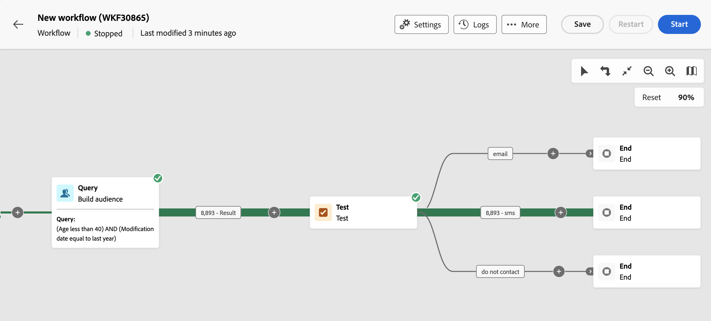

# 測試 {#test}

>[!CONTEXTUALHELP]
>id="acw_orchestration_test"
>title="測試活動"
>abstract="「**測試**」活動是一種&#x200B;**流量控制**&#x200B;活動。您可以藉此根據指定條件啟用轉變。"

>[!CONTEXTUALHELP]
>id="acw_orchestration_test_conditions"
>title="條件"
>abstract="「**測試**」活動可以有多個輸出轉換。在工作流程執行期間，將相繼測試每個條件，直到滿足其中一個條件。如果沒有滿足任何條件，工作流程將沿著「**[!UICONTROL 預設條件]**」的路徑繼續。如果沒有啟用預設條件，工作流程會在此時停止。"

「**測試**」活動是一種&#x200B;**流量控制**&#x200B;活動。您可以藉此根據指定條件啟用轉變。

## 設定測試活動 {#test-configuration}

請依照下列步驟設定&#x200B;**測試**&#x200B;活動：

1. 將&#x200B;**測試**&#x200B;活動新增至工作流程。

1. 根據預設，**[!UICONTROL Test]**&#x200B;活動會呈現簡單的布林值測試。 如果符合「True」轉變中定義的條件，則會啟動此轉變。 否則，將會啟用預設的「False」轉變。

1. 若要設定與轉變關聯的條件，請按一下&#x200B;**[!UICONTROL 開啟個人化對話方塊]**&#x200B;圖示。 使用運算式編輯器來定義啟動此轉變所需的規則。 您也可以善用事件變數、條件和日期/時間函式。 [瞭解如何使用事件變數和運算式編輯器](../event-variables.md)

   此外，您可以修改&#x200B;**[!UICONTROL 標籤]**&#x200B;欄位，以個人化工作流程畫布上的轉變名稱。

   

1. 您可以新增多個輸出轉變到&#x200B;**[!UICONTROL 測試]**&#x200B;活動。 若要這麼做，請按一下&#x200B;**[!UICONTROL 新增條件]**&#x200B;按鈕，並為每個轉變設定標籤和相關聯的條件。

1. 在工作流程執行期間，將相繼測試每個條件，直到滿足其中一個條件。如果沒有滿足任何條件，工作流程將沿著「**[!UICONTROL 預設條件]**」的路徑繼續。如果沒有啟用預設條件，工作流程會在此時停止。

## 範例 {#example}

在此範例中，會根據&#x200B;**[!UICONTROL 建置對象]**&#x200B;活動鎖定的設定檔數量啟動不同的轉變：
* 如果目標設定檔超過10,000個，則會傳送電子郵件訊息。
* 若為1,000至10,000個設定檔，則會傳送簡訊。
* 如果目標設定檔低於1,000，則會導向至「請勿聯絡」轉變。

為此，已在「電子郵件」和「簡訊」條件中運用`vars.recCount`事件變數，以計算目標設定檔的數量並啟用適當的轉變。

