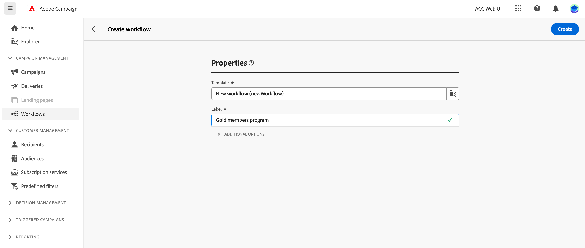
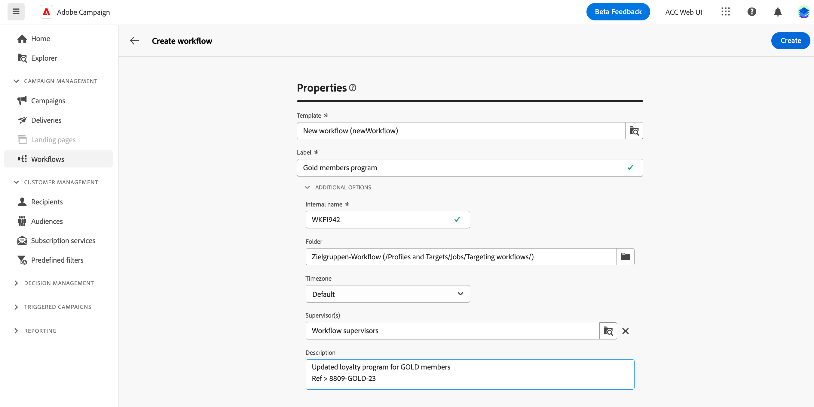
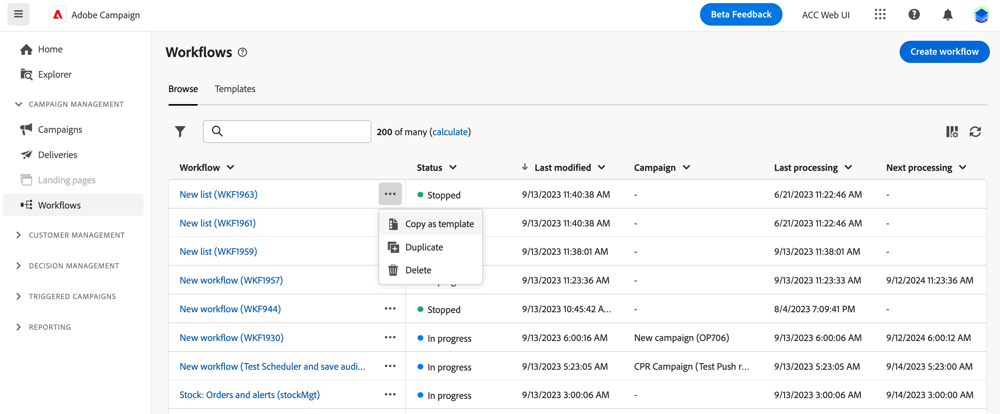
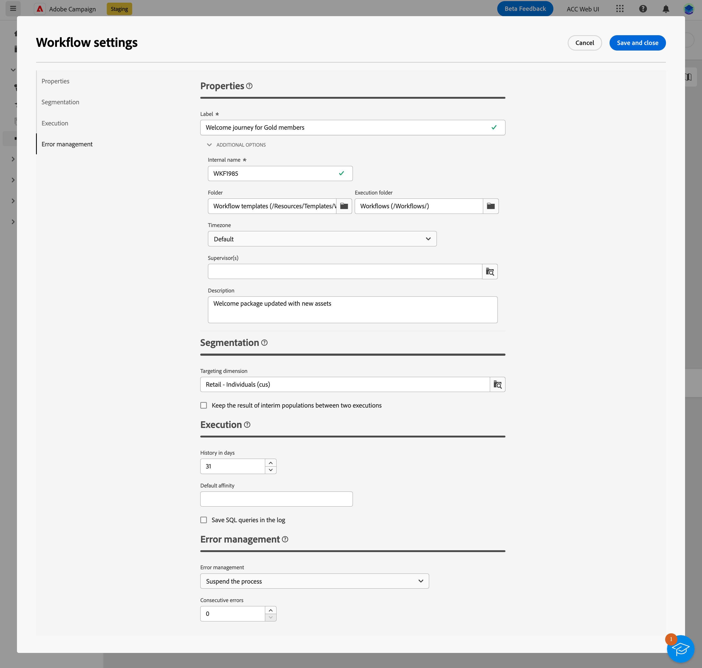
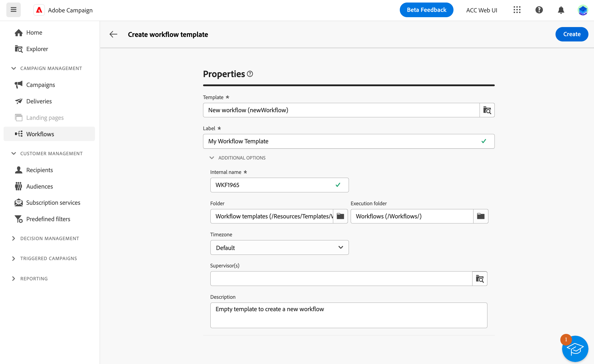
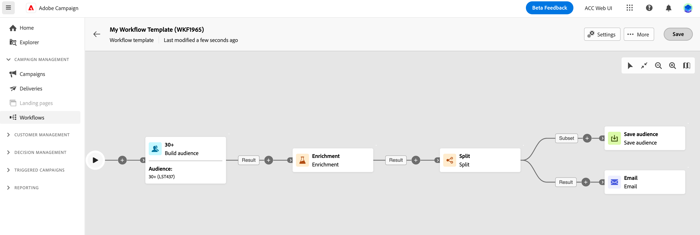

# 建立工作流程 {#create-first-workflow}

>[!CONTEXTUALHELP]
>id="acw_campaign_creation_workflow"
>title="行銷活動中的工作流程清單"
>abstract="「**工作流程**」標籤會列出連結至目前行銷活動的所有工作流程。按一下工作流程的名稱以進行編輯。使用「**建立工作流程**」按鈕，為此行銷活動新增工作流程。"

您可以在行銷活動中建立獨立的工作流程或工作流程。 第一步是選取範本並定義其一般屬性。 之後，您可以視需要設定其他設定。

若要這麼做，請依照以下步驟進行：

1. 若要建立&#x200B;**獨立工作流程**，請瀏覽至&#x200B;**工作流程**&#x200B;功能表。 若要建立&#x200B;**行銷活動工作流程**，請瀏覽至&#x200B;**行銷活動**&#x200B;功能表，並開啟您要為其建立新工作流程的行銷活動。

1. 按一下畫面右上角的&#x200B;**[!UICONTROL 建立工作流程]**&#x200B;按鈕。

   {zoomable="yes"}

1. 在工作流程&#x200B;**屬性**&#x200B;對話方塊中，選取要用來建立工作流程的範本（您也可以使用預設的內建範本）。 [進一步瞭解工作流程範本](#workflow-templates)。

1. 輸入工作流程的標籤。 此外，強烈建議您在畫面的&#x200B;**[!UICONTROL 其他選項]**&#x200B;區段的專屬欄位中，為工作流程新增說明。

1. 展開&#x200B;**[!UICONTROL 其他選項]**&#x200B;區段以設定更多工作流程設定。 瞭解如何在[此頁面](workflow-settings.md#properties)中設定工作流程屬性

   {zoomable="yes"}

1. 按一下「**[!UICONTROL 建立工作流程]**」按鈕以確認建立您的工作流程。

您的工作流程現已建立，並可在工作流程清單中使用。 您現在可以存取其視覺畫布，並開始新增、設定和協調其將執行的任務。 [瞭解如何協調工作流程活動](orchestrate-activities.md)。

## 使用工作流程範本 {#workflow-templates}

>[!CONTEXTUALHELP]
>id="acw_workflow_template_for_campaign"
>title="工作流程範本"
>abstract="工作流程範本包含預先設定的設定和活動，可重複使用它們來建立新的工作流程。"

>[!CONTEXTUALHELP]
>id="acw_workflow_template_creation_properties"
>title="工作流程屬性"
>abstract="工作流程範本包含預先設定的設定和活動，可重複使用它們來建立新的工作流程。在此畫面中，輸入工作流程範本的標籤並設定其設定，例如其內部名稱、資料夾和執行資料夾、時區和主管群組。"

工作流程範本包含預先設定的設定和活動，可重複使用它們來建立新的工作流程。建立工作流程時，您可以從工作流程屬性中選取工作流程的範本。 預設會提供空白範本。

您可以從現有工作流程建立範本，或從頭開始建立新範本。 兩種方法皆詳述於下方。

>[!BEGINTABS]

>[!TAB 從現有工作流程建立範本]

若要從現有工作流程建立工作流程範本，請遵循下列步驟：

1. 開啟&#x200B;**工作流程**&#x200B;功能表，並瀏覽至工作流程以另存為範本。
1. 按一下工作流程名稱右側的三個點，然後選擇&#x200B;**復製為範本**。

   {zoomable="yes"}

1. 在快顯視窗中，確認範本建立。
1. 在工作流程範本畫布中，視需要檢查、新增及設定活動。
1. 從&#x200B;**設定**&#x200B;按鈕瀏覽至設定，以變更工作流程範本的名稱，並輸入說明。
1. 選取範本的&#x200B;**資料夾**&#x200B;和&#x200B;**執行資料夾**。 資料夾是工作流程範本的儲存位置。 執行資料夾是儲存根據此範本建立的工作流程的資料夾。

   {zoomable="yes"}

   其他屬性與工作流程相同。 在[本頁](workflow-settings.md#properties)中了解更多

1. 儲存您的變更。

範本清單現在提供工作流程範本。 您可以根據此範本建立工作流程。 此工作流程將使用範本中定義的設定和活動進行預先設定。

>[!TAB 從頭開始建立範本]

若要從頭開始建立工作流程範本，請遵循下列步驟：

1. 開啟&#x200B;**工作流程**&#x200B;功能表，並瀏覽至&#x200B;**範本**&#x200B;標籤。 您可以檢視可用工作流程範本的清單。
1. 按一下畫面右上角的&#x200B;**[!UICONTROL 建立範本]**&#x200B;按鈕。
1. 輸入標籤並開啟其他選項，以輸入工作流程範本的說明。
1. 選取範本的資料夾和執行資料夾。 資料夾是工作流程範本的儲存位置。 執行資料夾是儲存根據此範本建立的工作流程的資料夾。

   {zoomable="yes"}

   其他屬性與工作流程相同。 在[本頁](workflow-settings.md#properties)中了解更多

1. 按一下「**建立**」按鈕以確認您的設定。
1. 在工作流程範本畫布中，視需要新增並設定活動。

   {zoomable="yes"}

1. 儲存您的變更。

範本清單現在提供工作流程範本。 您可以根據此範本建立工作流程。 此工作流程將使用範本中定義的設定和活動進行預先設定。

>[!ENDTABS]
