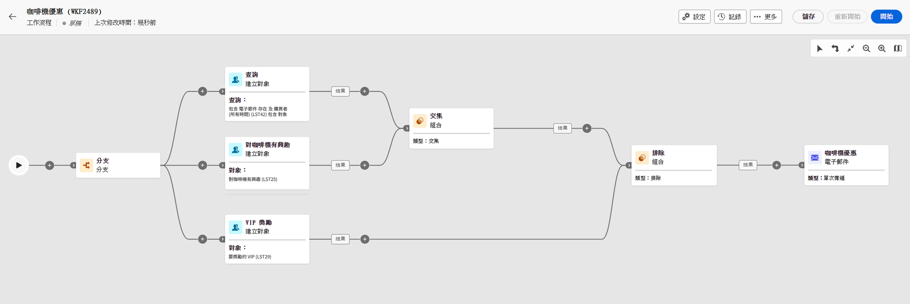

# 用於建立工作流程的主要原則 {#gs-workflow-creation}

透過 Campaign v8 Web，您可以將工作流程建置到視覺化畫布中，以設計跨管道流程，例如分段、行銷活動執行、檔案處理。

工作流程可從工作流程選單中建立為獨立的工作流程，也可以直接在行銷活動中建立，在後者的情況下，工作流程會連結至行銷活動並和所有其他行銷活動的工作流程一起執行。

## 工作流程內部有什麼？

工作流程圖表代表應該發生的情況。它會說明要執行的各種任務以及任務如何連結在一起。

每個工作流程都包含：

* **活動**：活動指要執行的任務。各種活動在圖表中會以圖示表示。每種活動都有特定屬性和所有活動共有的其他屬性。

  在工作流程圖表中，一個特定活動可以產生多個任務，尤其是存在迴圈或週期性動作時。

* **轉變**：轉變會將來源活動連結到目標活動並定義其序列。

* **工作表**：工作表包含轉變攜帶的所有資訊。每個工作流程會使用多個工作表。在這些表格中傳達的資料可以在整個工作流程的生命週期中使用。

## 建立工作流程的主要步驟

建立工作流程的主要步驟如下所示：

