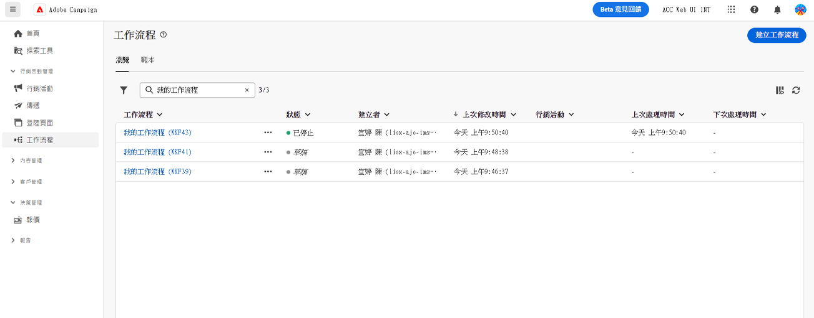
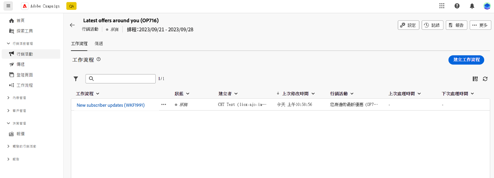

# 用於建立工作流程的主要原則 {#gs-workflow-creation}

透過 Adobe Campaign Web，您可以將工作流程建置到視覺化畫布中，以設計跨管道流程，例如分段、行銷活動執行、檔案處理。

## 工作流程內部有什麼？ {#gs-workflow-inside}

工作流程圖表代表應該發生的情況。它會說明要執行的各種任務以及任務如何連結在一起。

{zoomable=&quot;yes&quot;} {zoomable=&quot;yes&quot;}

每個工作流程都包含：

* **活動**：活動指要執行的任務。各種活動在圖表中會以圖示表示。每種活動都有特定屬性和所有活動共有的其他屬性。

  在工作流程圖表中，一個特定活動可以產生多個任務，尤其是存在迴圈或週期性動作時。

* **轉變**：轉變會將來源活動連結到目標活動並定義其序列。

* **工作表**：工作表包含轉變攜帶的所有資訊。每個工作流程會使用多個工作表。在這些表格中傳達的資料可以用於整個工作流程的生命週期。

## 建立工作流程的關鍵步驟 {#gs-workflow-steps}

行銷活動提供兩種建立工作流程的方法：

1. 工作流程可以從「**工作流程**」選單建立為獨立的工作流程。

   {zoomable=&quot;yes&quot;}

1. 可以從行銷活動的「**工作流程**」標籤，直接在行銷活動內建立工作流程。在包含於行銷活動時，工作流程與所有其他行銷活動的工作流程一起執行，且報告量度全部在行銷活動層級分組。

   {zoomable=&quot;yes&quot;}

建立工作流程的關鍵步驟如下所示：

{zoomable=&quot;yes&quot;}

以下章節詳細介紹了這些步驟：

1. [建立您的工作流程並定義其屬性](create-workflow.md)
1. [協調和配置活動](orchestrate-activities.md)
1. [配置您的工作流程進階設定](workflow-settings.md)
1. [啟動您的工作流程並監控其執行情況](start-monitor-workflows.md)
