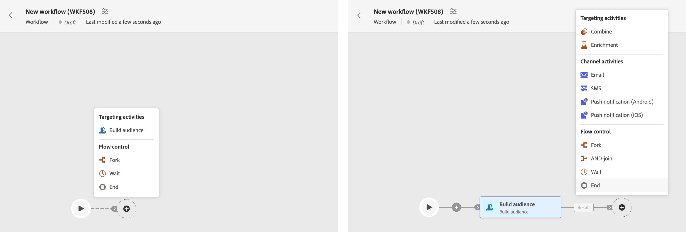
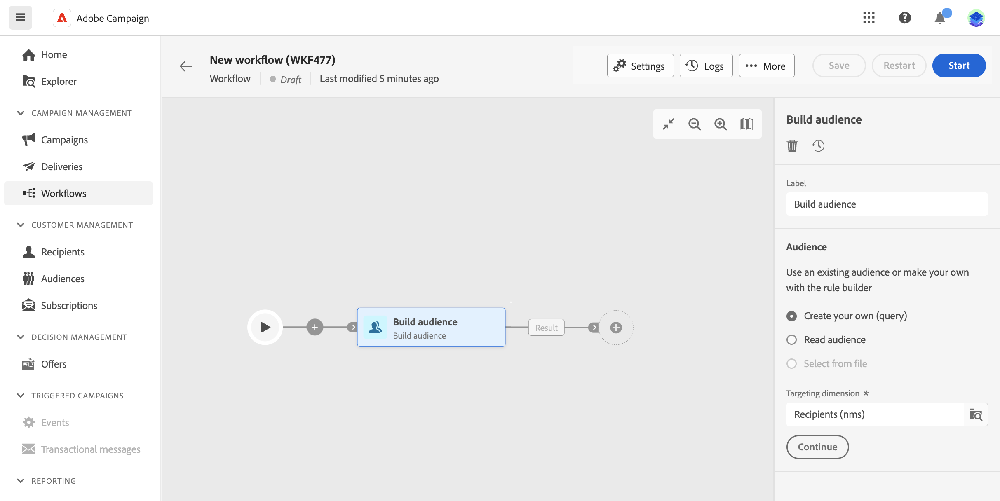
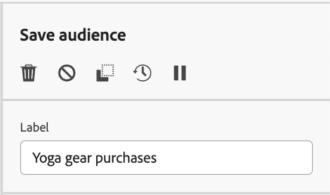

# 協調活動 {#orchestrate}

一旦您擁有 [已建立工作流程](create-workflow.md)，無論是從工作流程功能表還是在行銷活動中，您都可以開始協調它將執行的不同任務。 為此，提供了視覺畫布，可讓您建構工作流程圖表。 在此圖表中，您可以新增各種活動，並依序連線它們。

## 新增活動 {#add}

在設定的這個階段，圖表會顯示起始圖示，代表工作流程的開始。 若要新增第一個活動，請按一下 **+** 按鈕連線至啟動圖示。

可新增至圖表的活動清單隨即顯示。 可用的活動取決於您在工作流程圖表中的位置。 例如，新增第一個活動時，您可以透過鎖定受眾、分割工作流程路徑或設定 **等待** 活動以延遲工作流程執行。 另一方面，在 **建立對象** 活動，您可以利用目標定位活動來調整目標、透過頻道活動傳送傳遞內容給對象，或透過流量控制活動來組織工作流程程式。

{zoomable=&quot;yes&quot;}

將活動新增到圖表後，右側窗格會出現，可讓您使用特定設定來設定新新增的活動。 有關如何設定每個活動的詳細資訊，請參閱 [本節](activities/about-activities.md).

{zoomable=&quot;yes&quot;}

重複此程式，根據您希望工作流程執行的任務，新增所需數量的活動。 請注意，您也可以在兩個活動之間插入新活動。 若要這麼做，請按一下 **+** 按鈕在活動之間的轉變上，選取所需的活動並在右側窗格中設定它。

若要移除活動，請在畫布中選取該活動，然後按一下 **刪除** 圖示加以存取（在活動屬性中）。

>[!TIP]
>
>您可以選擇個人化每個活動之間的轉變名稱。 要執行此操作，請選取轉變並在右窗格中變更其標籤。

## 管理活動 {#manage}

新增活動時，屬性窗格中會有動作按鈕，可讓您執行多項作業。 您可以：

* **刪除** 畫布中的活動。
* **停用/啟用** 活動。 執行工作流程時，不會執行已停用的活動以及相同路徑上的下列活動，且工作流程會停止。
* **複製** 活動。 然後您可以按一下「 」，將其貼到任何工作流程中 **+** 按鈕並選取「貼上1活動」。
* 存取活動的 **記錄檔與任務**.
* **暫停/繼續** 活動。 執行工作流程時，它會在暫停的活動中暫停。 系統不會執行對應的任務，以及在相同路徑中跟隨著該任務的所有任務。

{zoomable=&quot;yes&quot;}{width="50%"}

## 範例 {#example}

以下是工作流程範例，其設計是透過電子郵件傳送電子郵件給所有對咖啡機感興趣的客戶(VIP客戶除外)。

{zoomable=&quot;yes&quot;}{zoomable=&quot;yes&quot;}

為達成此目的，已新增下列活動：

* A **[!UICONTROL 分支]** 活動將工作流程劃分為三個路徑（每個客戶集各一個），
* **[!UICONTROL 建立對象]** 以三組客戶為目標的活動：

   * 擁有電子郵件的客戶，
   * 屬於既有「感興趣的咖啡機」受眾的客戶，
   * 屬於既有「VIP或獎勵」對象的客戶。

* A **[!UICONTROL 合併]** 活動，透過電子郵件將客戶和對咖啡機感興趣的客戶分組，
* A **[!UICONTROL 合併]** 排除VIP客戶的活動，
* 一個 **[!UICONTROL 電子郵件傳遞]** 傳送電子郵件給所產生客戶的活動。

完成工作流程後，請新增 **[!UICONTROL 結束]** 活動在圖表結尾。 此活動可讓您以視覺化方式標示工作流程的結尾，而不會對功能造成影響。

成功設計工作流程圖表後，您可以執行工作流程並追蹤其各種任務的進度。 [了解如何啟動工作流程並監視其執行](start-monitor-workflows.md)
