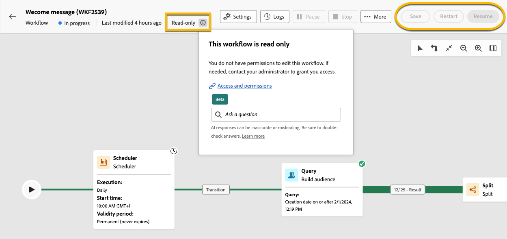
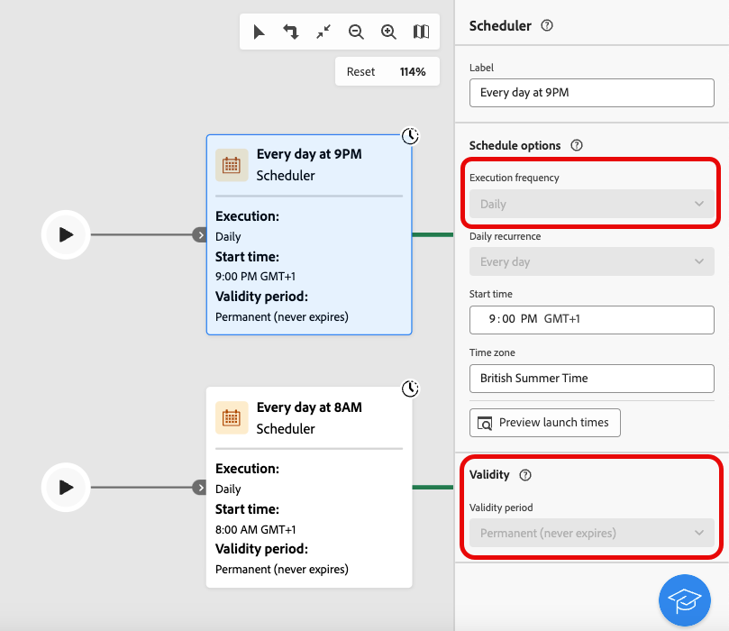
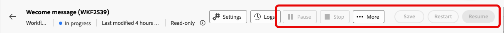
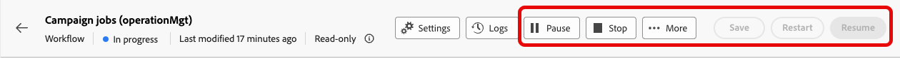

# 關於唯讀工作流程 {#readonly-workflows}

>[!CONTEXTUALHELP]
>id="acw_wf_read_only_canvas"
>title="此工作流程為唯讀資料"
>abstract="因為您的權限或是工作流程類型，所以無法編輯此工作流程。"

部分工作流程為唯讀。 內建的技術工作流程一律為唯讀，但此重構也可以在其他型別的工作流程上啟動。

Campaign使用者存取Adobe Campaign資料的能力可能會受到限制。 Campaign管理員可授予他們檢視部分功能的權利，但不授予他們編輯或修改這些功能的權利。 資料的使用者許可權是確保資料和流程安全的關鍵。 在[本節](../get-started/permissions.md)中進一步瞭解Campaign的許可權管理

當工作流程處於唯讀模式時：

* 在&#x200B;**[!UICONTROL 設定]**&#x200B;按鈕附近提及&#x200B;**[!UICONTROL 唯讀]**
* 無法存取動作按鈕

{zoomable="yes"}

使用者無法在唯讀工作流程中編輯任何內容。 他們不可變更活動的設定。

{zoomable="yes"}

使用者無法刪除工作流程。

{zoomable="yes"}

## 唯讀工作流程的型別 {#readonly-workflow-types}

根據工作流程的型別，唯讀模式可能會有所不同。

### 行銷活動工作流程 {#readonly-campaign-wf}

在唯讀行銷活動工作流程的情況下，使用者無法存取監視按鈕。

{zoomable="yes"}

### 技術工作流程 {#readonly-tech-wf}

內建的技術工作流程對於所有Campaign使用者都是唯讀的，即使對於管理員也是如此。 不過，使用者可視需要&#x200B;**暫停**&#x200B;或&#x200B;**停止**。 僅允許這些動作。

{zoomable="yes"}

在[本節](https://experienceleague.adobe.com/en/docs/campaign/automation/workflows/introduction/wf-type/technical-workflows)中進一步瞭解技術工作流程
