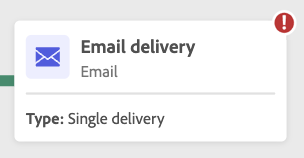

# 開始和監視您的工作流程 {#start-monitor}

一旦您建立了工作流程並設計了要在畫布中執行的任務，您就可以啟動它並監視其執行方式。

## 開始工作流程 {#start}

若要啟動工作流程，請導覽至 **[!UICONTROL 工作流程]** 選單或關聯的行銷活動，然後按一下 **[!UICONTROL 開始]** 按鈕來切換畫布的畫面。

工作流程執行後，畫布中的每個活動都會依序執行，直到達到工作流程結尾為止。

您可以使用視覺流量即時追蹤目標設定檔的進度。 這可讓您快速識別每個活動的狀態，以及活動中轉換的個人檔案數。

## 工作流程轉換 {#transitions}

在工作流程中，透過轉變從一個活動傳輸到另一個活動的資料會儲存在臨時工作表中。 此資料可針對每個轉變顯示。 要執行此操作，請選取轉變以在熒幕右側開啟其屬性。

* 按一下 **[!UICONTROL 預覽結構描述]** 顯示工作表的綱要。
* 按一下 **[!UICONTROL 預覽結果]** 以視覺化方式呈現所選轉變中傳輸的資料。

## 監視活動執行 {#activities}

每個活動方塊右上角的視覺指示器可讓您檢查其執行：

| 視覺指示器 | 說明 |
|-----|------------|
| {width="70%"} | 活動目前正在執行。 |
| {width="70%"} | 活動需要您注意。 這可能涉及確認傳遞的傳送或採取必要行動。 |
| {width="70%"} | 活動發生錯誤。 若要解決此問題，請開啟工作流程記錄檔以取得詳細資訊。 |
| {width="70%"} | 已成功執行活動。 |

## 監視日誌和任務 {#logs-tasks}

監視工作流程記錄和任務是分析工作流程並確保其正常執行的關鍵步驟。 可從存取 **[!UICONTROL 記錄檔]** 圖示，可在動作工具列和每個活動的屬性窗格中使用。

此 **[!UICONTROL 記錄檔與任務]** 功能表提供工作流程執行的歷史記錄，記錄所有使用者動作和遇到的錯誤。 此歷史記錄會儲存至工作流程中指定的期間 [執行選項](workflow-settings.md). 在這段期間，會儲存所有訊息，即使在重新啟動工作流程後亦然。 如果您不想儲存先前執行的訊息，請按一下 **[!UICONTROL 清除歷史記錄]** 按鈕。

提供兩種資訊：

* 此 **[!UICONTROL 記錄]** 索引標籤包含所有工作流程活動的執行歷史記錄。 其會按時間順序，對執行的操作和執行錯誤進行索引。
* 此 **[!UICONTROL 任務]** 索引標籤會詳細說明活動的執行順序。

在這兩個標籤中，您可以選擇顯示的欄及其順序、套用篩選器，並使用搜尋欄位來快速尋找所需的資訊。

## 工作流程執行命令 {#execution-commands}

右上角的動作列提供可讓您管理工作流程執行的命令。 您可以：

* **[!UICONTROL 開始]** / **[!UICONTROL 繼續]** 工作流程的執行會接著呈現「進行中」狀態。 如果工作流程已暫停，則會繼續進行，否則會啟動工作流程並啟動初始活動。

* **[!UICONTROL 暫停]** 工作流程的執行會接著呈現「已暫停」狀態。 在繼續之前，不會啟用任何新活動，但不會暫停進行中的作業。

* **[!UICONTROL 停止]** 正在執行的工作流程，接著會呈現「已完成」狀態。 如果可能的話，進行中的作業會被中斷。 您無法從工作流程停止的同一位置繼續。
