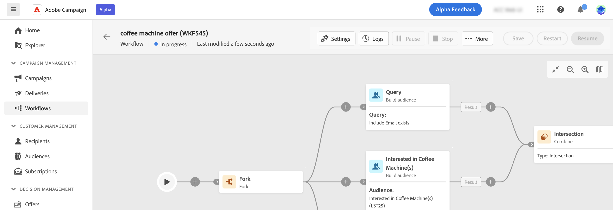

# 設定工作流程設定 {#workflow-settings}

在畫布中協調工作流程活動時，您可以存取與工作流程相關的進階設定。 例如，您可以為工作流程設定特定時區、管理工作流程在發生錯誤時的行為方式，或管理應清除工作流程歷史記錄的延遲。

這些設定在建立工作流程時，會在選取的範本中預先設定，但可視需要為此特定工作流程進行編輯。

若要這麼做，請按一下 **[!UICONTROL 設定]** 按鈕在工作流程畫布上方的動作列中。

{width="70%" align="left"}

## 工作流程屬性 {#properties}

>[!CONTEXTUALHELP]
>id="acw_workflow_settings_properties"
>title="工作流程屬性"
>abstract="本區段提供一般工作流程屬性，在建立工作流程時也可以存取這些屬性。您可以選擇用於建立工作流程的範本並指定標籤。展開其他選項區段以完成特定設定，例如工作流程儲存資料夾或時區。"

此 **[!UICONTROL 屬性]** 區段提供一般設定，當您建立工作流程時也可以存取這些設定。

{width="70%" align="left"}

這些屬性包括：

* 此 **[!UICONTROL 標籤]** 顯示在清單中的工作流程。
* 此 **[!UICONTROL 內部名稱]** 的工作流程中。
* 此 **[!UICONTROL 資料夾]** 工作流程的儲存位置。
* 預設 **[!UICONTROL 時區]** 用於工作流程的所有活動。 依預設，工作流程的時區是為目前的Campaign運運算元定義的時區。
可能的值包括：
   * **伺服器時區** 使用Adobe Campaign應用程式伺服器的時區
   * **運運算元時區** 用於使用在使用者端主控台中執行工作流程之Adobe Campaign運運算元的時區（如運運算元的設定檔所定義）
   * **資料庫的時區** 使用資料庫伺服器的時區
   * 特定時區
* 當工作流程失敗時，屬於在中選取之運運算元群組的運運算元 **[!UICONTROL 監督員]** 欄位會透過電子郵件通知。
* *您也可以輸入 **[!UICONTROL 說明]** 工作流程的其他資訊。

當工作流程為 [與行銷活動相關聯](create-workflow.md)，則會顯示在 **[!UICONTROL 連結的行銷活動]** 欄位。 您可以從該欄位開啟關聯的行銷活動。

## 細分設定  {#segmentation-settings}

>[!CONTEXTUALHELP]
>id="acw_workflow_settings_segmentation"
>title="細分設定"
>abstract="在此區段中，您可以選取目標維度用來在工作流程中鎖定設定檔，並選擇保留兩次執行之間的工作流程結果。此選項應僅用於測試目的，絕不能在生產工作流程中啟用。"

* **[!UICONTROL 目標維度]**：選取用來定位設定檔的目標維度：收件者、合約受益者、操作員、訂閱者等。 [進一步瞭解目標維度](../audience/targeting-dimensions.md)

* **[!UICONTROL 保留兩次執行之間的中期母體結果]**：依預設，僅保留上次執行工作流程的工作表。 技術工作流程會清除先前執行的工作表，每天都執行。

  如果啟用此選項，即使執行工作流程後，也會保留工作表格。 您可以將其用於測試目的，因此必須使用 **僅限** 在開發或中繼環境中。 絕不可在生產工作流程中勾選該專案。

## 執行設定  {#exec-settings}

>[!CONTEXTUALHELP]
>id="acw_workflow_settings_execution"
>title="執行設定"
>abstract="在此區段中，您可以設定與工作流程執行相關的設定，例如工作流程歷史記錄的保留天數。"

* **[!UICONTROL 歷史記錄（天）]**：指定必須清除歷程記錄的天數。 歷史記錄包含與工作流程相關的元素：記錄、任務、事件（連結至工作流程操作的技術物件）。 現成的工作流程範本預設值為30天。 歷史記錄的清除工作是由資料庫清除技術工作流程執行，預設每天執行

  >[!IMPORTANT]
  >
  >如果「**[!UICONTROL 歷史記錄 (天)]**」欄位為空白，欄位值將被視為「1」，表示歷史記錄將在 1 天後清除。

* **[!UICONTROL 預設相似性]**：如果您的安裝包含數個工作流程伺服器，請使用此欄位來選擇要執行工作流程的電腦。 如果此欄位中定義的值不存在於任何伺服器上，工作流程將維持擱置狀態。

* **[!UICONTROL 將SQL查詢儲存在記錄檔中]**：核取此選項以將SQL查詢從工作流程儲存到記錄中。 此功能保留給進階使用者使用。它適用於包含目標定位活動的工作流程，例如 **[!UICONTROL 建立對象]**. 啟用此選項後，工作流程執行期間傳送到資料庫的SQL查詢會顯示在工作流程的日誌中，可讓您分析這些查詢以最佳化查詢或診斷問題。

## 錯誤管理設定  {#error-settings}

>[!CONTEXTUALHELP]
>id="acw_workflow_settings_error"
>title="錯誤管理設定"
>abstract="在此區段中，您可以定義工作流程在執行期間應如何管理錯誤。 您可以選擇暫停處理序、忽略特定數目的錯誤，或停止工作流程執行。"

* **[!UICONTROL 錯誤管理]**：此欄位可讓您定義工作流程任務發生錯誤時應採取的動作。 有三個可能的選項：

   * **[!UICONTROL 暫停處理序]**：工作流程會自動暫停，其狀態會變更為 **[!UICONTROL 已失敗]**. 問題解決後，使用繼續工作流程 **[!UICONTROL 繼續]** 按鈕。
   * **[!UICONTROL 忽略]**：觸發錯誤的工作狀態會變更為 **[!UICONTROL 已失敗]**，但工作流程會保留 **[!UICONTROL 已開始]** 狀態。 <!-- TO ADD ONCE SCHEUDLER IS AVAILABLE This configuration is relevant for recurring tasks: if the branch includes a scheduler, it will start normally next time the workflow is executed.-->
   * **[!UICONTROL 中止處理序]**：工作流程會自動停止，其狀態會變更為 **[!UICONTROL 已失敗]**. 問題解決後，請使用重新啟動工作流程 **[!UICONTROL 開始]** 按鈕。

* **[!UICONTROL 連續錯誤]**：此欄位可在下列情況下使用 **[!UICONTROL 忽略]** 值選取於 **[!UICONTROL 發生錯誤時]** 欄位。 您可以指定程序停止之前可以忽略的錯誤數。達到此數字後，工作流程狀態會變更為 **[!UICONTROL 已失敗]**. 如果此欄位的值為 0，則無論錯誤數為何，工作流程都不會停止。
