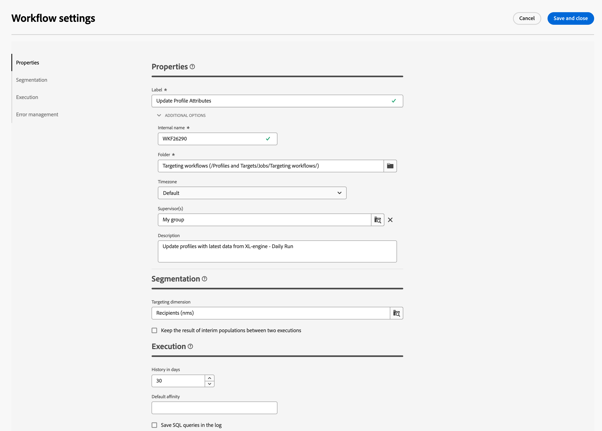

# 設定進階工作流程設定 {#workflow-settings}

在畫布中協調工作流程活動時，您可以存取與工作流程相關的進階設定。 例如，您可以為工作流程設定特定時區、管理工作流程在發生錯誤時的行為方式，或管理應清除工作流程歷史記錄的延遲。

若要這麼做，請按一下 **[!UICONTROL 工作流程設定]** 圖示填入工作流程標籤旁。

## 工作流程屬性 {#properties}

>[!CONTEXTUALHELP]
>id="acw_workflow_settings_properties"
>title="工作流程屬性"
>abstract="待定"

工作流程屬性區段提供一般屬性，在建立工作流程時也可以存取。

* **[!UICONTROL 標籤]**：顯示在清單中的工作流程標籤。
* **[!UICONTROL 內部名稱]**：工作流程的內部名稱。
* **[!UICONTROL 資料夾]**：工作流程應儲存的資料夾。
* **[!UICONTROL 連結的行銷活動]**：如果工作流程已在行銷活動中建立，則會顯示此欄位。 它可讓您開啟關聯的行銷活動。
* **[!UICONTROL 時區]**：定義預設用於工作流程所有活動的特定時區。 依預設，工作流程的時區是為目前的 Campaign 操作者定義的時區。
* **[!UICONTROL 監督員]**：當工作流程發生錯誤時，只要屬於工作流程監督群組的操作員的電子郵件地址列在其設定檔中，就會透過電子郵件通知該操作員。
* **[!UICONTROL 說明]**：使用此欄位提供工作流程的說明。

## 細分設定

>[!CONTEXTUALHELP]
>id="acw_workflow_settings_segmentation"
>title="細分設定"
>abstract="待定"

* **[!UICONTROL 目標維度]**：選取用來鎖定設定檔的目標維度：收件者、合約受益者、操作員、訂閱者等。
* **[!UICONTROL 保留兩次執行之間的中期母體結果]**：依預設，只會保留上次執行工作流程的工作表。 技術工作流程會清除先前執行的工作表，每天都會執行。

   如果啟用此選項，即使工作流程已執行，也會保留工作表格。 您可以將其用於測試目的，因此必須僅用於開發或中繼環境。 絕不可在生產工作流程中勾選該專案，

## 工作流程執行設定

>[!CONTEXTUALHELP]
>id="acw_workflow_settings_execution"
>title="執行設定"
>abstract="待定"

* 歷史記錄 (天)：資料庫的工作表會保留執行 (任務、事件、記錄) 的歷史記錄。您可以在此處定義此工作流程的封存天數：清除程序會每天刪除一次最舊的封存檔。如果此欄位的值為零，則永遠不會刪除封存檔。

   指定天數，在此天數後歷史記錄必須清除。歷史記錄包含與工作流程相關的元素：記錄、任務、事件 (連結到工作流程作業的技術物件)，以及&#x200B;**[!UICONTROL 傳輸檔案]**&#x200B;活動下載的檔案。立即可用工作流程範本的預設值為 30 天。

   歷史記錄的清除工作是由資料庫清除技術工作流程執行，預設每天執行

   >[!IMPORTANT]
   >
   >如果「**[!UICONTROL 歷史記錄 (天)]**」欄位為空白，欄位值將被視為「1」，表示歷史記錄將在 1 天後清除。

* 預設相關性：此欄位可讓您強制工作流程或工作流程活動在特定電腦上執行。如果您的安裝包括多個工作流程伺服器，請使用此欄位選擇工作流程將在其中執行的電腦。如果在此欄位定義的值不存在於任何伺服器，工作流程將保持待處理狀態。

* 將 SQL 查詢儲存在記錄中：可讓您將工作流程中的 SQL 查詢儲存到記錄中。(在哪裡存取 SQL 記錄？)

   此功能保留給進階使用者使用。它涉及包含目標定位活動 (查詢、聯合、交集等) 的工作流程。勾選此選項後，在工作流程執行期間傳送到資料庫的 SQL 查詢將顯示在 Adobe Campaign 中：這表示您可以分析它們以最佳化查詢或診斷問題。

   如果啟用選項，在新增至工作流程 (行銷活動工作流程除外) 和&#x200B;**[!UICONTROL 屬性]**&#x200B;活動的「**[!UICONTROL SQL 記錄]**」索引標籤中會顯示查詢。「**[!UICONTROL 稽核]**」索引標籤也包含 SQL 查詢。

## 錯誤管理設定

>[!CONTEXTUALHELP]
>id="acw_workflow_settings_error"
>title="錯誤管理設定"
>abstract="待定"

* 此欄位可讓您定義工作流程的任務發生錯誤時要採取的動作。您有兩個選擇：

   停止程序：工作流程自動暫停。工作流程狀態變更為「失敗」。問題解決後，使用「開始」或「重新開始」按鈕重新開始工作流程。

   忽略：觸發錯誤的任務狀態變更為「失敗」，但工作流保持「已開始」狀態。此設定與週期性任務相關：如果分支包含排程器，它將在下次工作流程執行時正常啟動。

* 連續錯誤：如果在「發生錯誤時」欄位中選取「忽略」值，可使用此欄位。您可以指定程序停止之前可以忽略的錯誤數。達到此數字後，工作流程狀態將變更為「失敗」。如果此欄位的值為 0，則無論錯誤數為何，工作流程都不會停止。
